So, it all started with a [Stanford Lifestyle Medicine article](https://longevity.stanford.edu/lifestyle/2024/05/30/what-excessive-screen-time-does-to-the-adult-brain/) about "What Excessive Screen Time Does to the Adult Brain".
You wouldn't have guessed it, but it's not healthy! I know, I know, this groundbreaking discovery probably won't change the world on its own. The awesome thing about this article however is that it actually gives you some advice on how to improve your life in this regard.

Their advice, which I took by heart, is "No Screen Time for the First Hour of the Day". Actually, they recommended this as a practice for a month, but I'm practicing it for half a year now.
I won't say it changed my life or anything, it's just something I've been doing ever since. I've been also thinking of stepping up my game for a while: **baning smartphones from the bedroom altogether**.

I'm thinking of setting up a nice charging station somewhere outside and leaving my phone there while I sleep. I could also get some nice bedroom lamp, and maybe read a book or something instead of being on my phone before sleep.
But there's one thing that prevents me from doing that...

# How do I get up in the morning?

Yes, that's right. Ever since I had a mobile phone (not even a smartphone), I'm using it as my alarm clock.
This is the most reliable way to wake me up. It has an internal battery, so it works during power outages. It synchronizes its clock to the network, so it will always alarm on time. It's portable and I can even choose the alarm sound.

It's really just the perfect solution for waking someone up. There was even quite a long period of my life, while used sleep tracking.
I purchased [Sleep as Android](https://play.google.com/store/apps/details?id=com.urbandroid.sleep) in **2015** and used it just until a few years ago.

I no longer use sleep tracking, but their little puzzles that you have to solve to turn off the alarm are pretty clever, and I still use this feature.
Sometimes I'm having a super hard time waking up. Since I overslept some of my meetings in the morning (which were super embarrassing to me), I have an NFC tag in the hallway that I have to scan to stop the alarm. (I used to do "simple maths" before, but as it turned out, it just helped me develop the ability to do maths in my sleep.)

So using a smartphone (or even a dumb phone) to wake me up is just the best thing I could have, but sadly it conflicts with my plan above. So I've got to look for an alternate solution.

# Getting an Alarm Clock

The _easy_ solution to this problem would be to just buy any alarm clock, put it on my bedside table and call it a day. But that would be the most boring solution imaginable.

You see, I can't just buy any alarm clock. If I'm going to get one, I need one that is specifically tuned for my needs. And that need is the need for running Linux. (Also the things I described above would be nice to have.)

So the only logical thing to do here is to ignore the market altogether, go ahead and design and build an alarm clock that ticks that all-important box, and maybe some others too.
(It's possible that there are clocks out there that would probably meet my needs, but there's no stopping now.)

I expect this project to take up years if not months. So instead of writing a post about it at the end (as I try with most of my projects), I try to write about it each time I hit a noteworthy milestone.

This post marks the first milestone, where I get a neat shell for my project.

# The Tesco Value CR-106 clock radio

When I was a kid, and I didn't have a mobile phone (or I didn't use it as an alarm clock, I can't remember). I had this exact model of a radio clock.

I remember going to the nearest Tesco, with my saved money, and there was a shelf full of radio alarm clocks. This one was on the end of the line, the cheapest option. They sold it in the usual white-blue "Tesco Value" box.

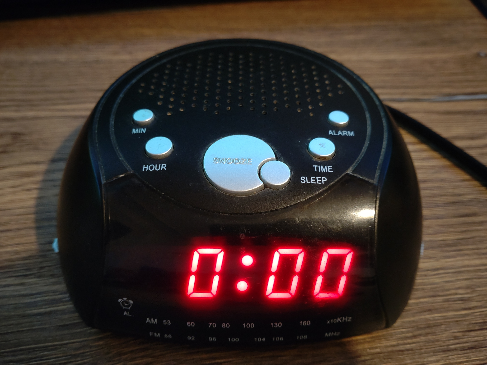

While it wasn't really the nicest option, I still remember this clock as "The radio alarm clock" that I had, and when I think about a "radio alarm clock," this comes to my mind.

Sadly, I no longer have mine, still I decided I want something that looks like this. The best way to achieve this (to me) is by getting one and modifying its internals.
At that time I didn't remember anything else about it aside from how it looked like, so I searched the local and online markets for one, but none of the ones I could find were to my liking.
Until eventually, I discovered that this was "The model," and after that, I could finally look for it.

I managed to find it at an online second-hand marketplace, for a few thousand local currency (that's actually not that much here), so I picked it up. It was mostly functional, a bit dirty (the picture above was made just when I got it home), the buttons were a bit hard to press, the radio sounded very crunchy, and it was missing its antenna.
But it was there! I was delighted about it. It brought back some of my childhood memories.

# Disassembly

So it is time to tear it down, so we can use its shell for _a greater purpose_, and maybe some of the internal components.

Fortunately, it is quite easy to take this thing apart. From the bottom there's only four screws holding the top piece to the bottom part. Take those out and the top can be lifted off.

But lifting off the top does not get us very far, as there a few are wires holing us back. One goes to a PCB on the top, which is for the buttons on the top, the other one is for the speaker.

The transparent part can be taken off easily when the top is lifted, it's not glued or screwed to anything.

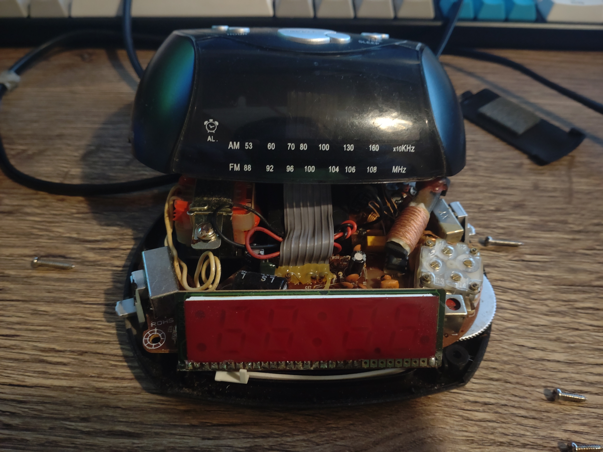

Peeking inside the machine, we can see that there is a main circuit board which seems to hold all the important parts. This board is held in with two more screws.

The PCB has some typical radio parts on it, like the ferrit rod antenna for AM reception, the variable capacitor thingy for tuning, and other stuff. Pretty typical cheap radio setup going on here, nothing unusual. 

There is also a (relative to modern things) big transformator. Indeed, no fancy switching power supply here. 
There are also four identical looking diodes next to a large capacitor on the main board. I assume this is how the DC power is produced for the parts requiring it.    

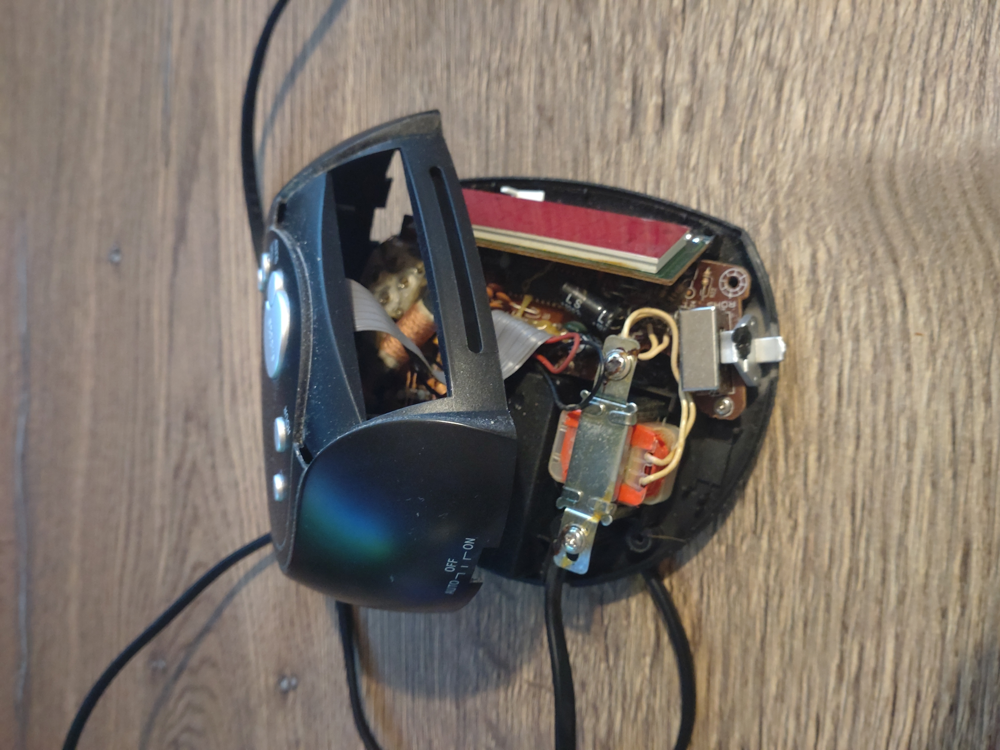

While looking at the main PCB, I noticed that there is an integrated circuit on it! I was curious about what that does. According to the mark on it, it's an _LM8560_.  

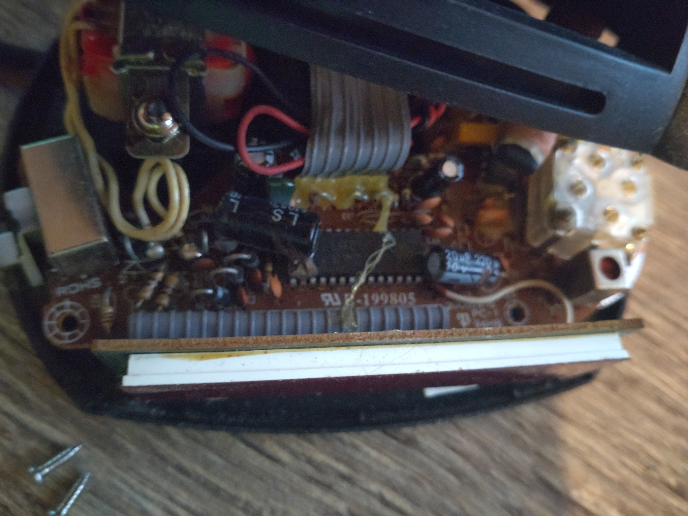

I checked it's datasheet to find out more about it, and I've got to say, it is a charming little chip. Check this out: 

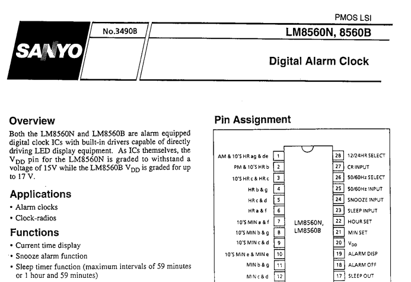

Yes, it's an alarm-clock-on-a-chip! Isn't this cool?!

Scanning through the datasheet, revealed me that really all the features of this device (except the radio part) are implemented on this single chip.
It literally does everything, from handling the backup battery, through generating the alarm tone (yes, it can do that instead of turning on the radio, it can also beep in the morning) to driving the LED display.

It takes the 50/60 Hz frequency from the powerline and uses that as the time reference, but it also uses that signal to other things, like driving the common cathodes of the duplex LED display.  

It's a nice chip. I assume that it found its way to many other low-end alarm clocks, that I never heard of. It's also nice that we have the datasheet, because it will serve as a great reference for figuring out other parts of the clock. 

Moving on, removing the screws and the transformer allows us to take off the main board of the bottom.

At least I hoped for that, as there are also a pair of wires that are holding it to the bottom. Which is for the battery compartment at the bottom.

All the wires I mentioned earlier are soldered to the main board. No connectors or anything like that. This is pretty typical for these inexpensive electronics of the era.

I usually try to be the least destructive possible, so I decided to de-solder all wires instead of cutting them. I'm not sure what kind of solder they used, but it was surprisingly easy to do so. At 280°C, the solder melted just fine.

I de-soldered the speaker and the battery connector, then I unscrewed the PCB on the top, for the buttons, and with that I could finally remove most the internals from the case.

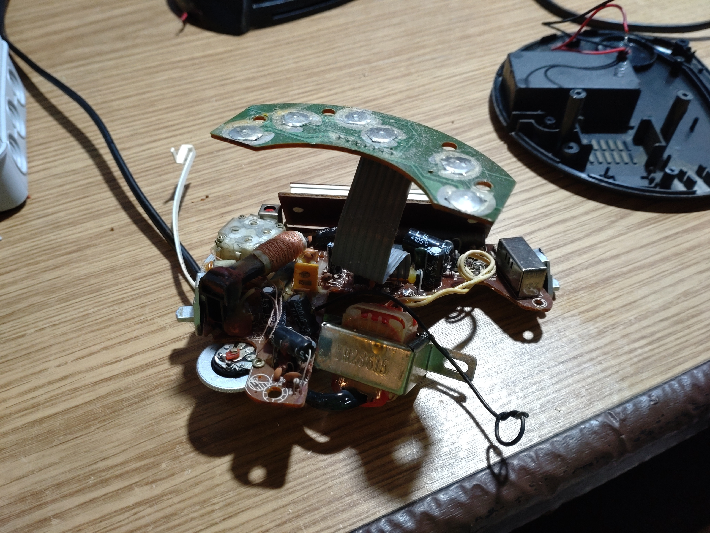

There is one last thing that needs to be removed from the case (mostly for cleaning reasons), that is the speaker.

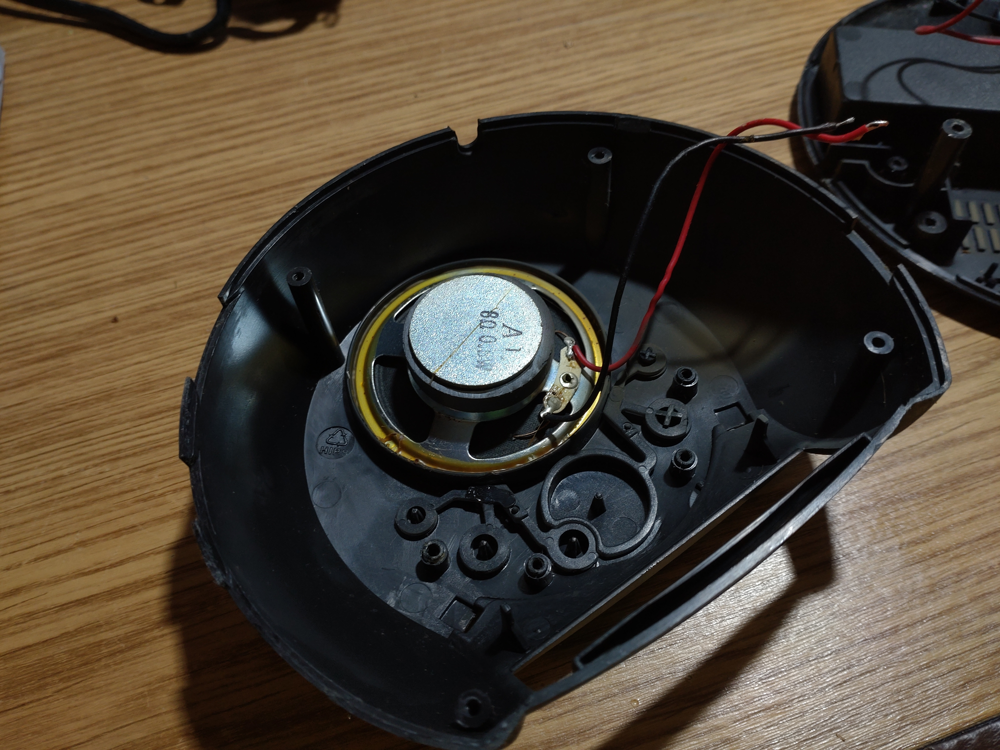

They used that ugly yellow glue, I just call "radio glue" to hold in the speaker. This is the kind of glue that was put on everywhere on all electronics in this era, for seemingly no other reason than just making repairs harder.
I'm not sure what exactly that is, so I'm not exactly sure what should dissolve it. I also shouldn't experiment as I might risk damaging the plastic of the shell (Like I did later...) so I resorted to scraping off the glue in hope of freeing the speaker. 

Eventually I managed to scrape off enough for it to come loose, and I could finally remove it. 

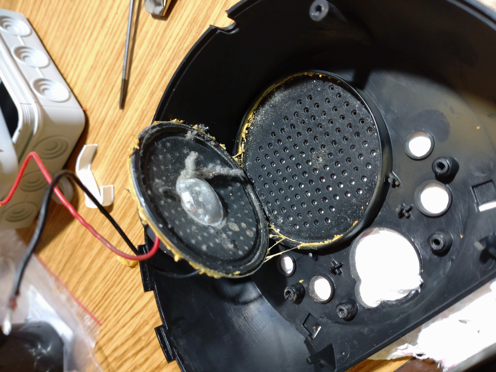

I'm glad I did that, and looking at the picture above, I might not even have to explain why.

After that was done, I gave a bath for top shell, the buttons and the transparent part, in warm soapy water.

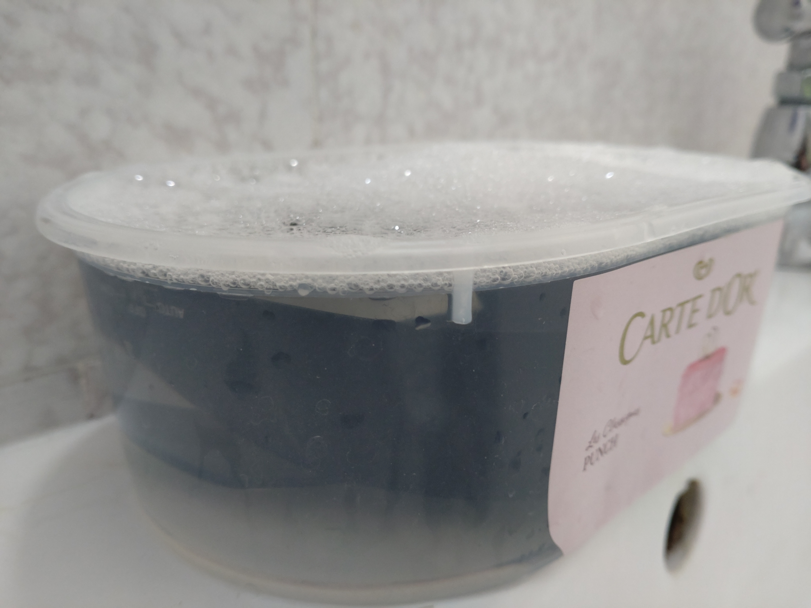

For the bottom part, I didn't want the stickers to come off, so I cleaned it with a brush and wet wipe, it came out just as well.

After drying it out, I put together the empty shell to see how it looks. I'm satisfied with the result. 

**WARNING:** As I couldn't get all of the ugly yellow glue off by scraping, and I didn't want to scrape the plastic too much, I started experimenting with some chemicals to remove it.
**This was a bad idea!** I thought isopropyl alcohol can do little harm, but as it poured to the other side, and I wiped it, it seems like I wiped of some black paint.
Since I didn't notice this at first, I kept wiping and when I realized what I've done, the top looked super-ugly...  I was sad and mad of how stupid I was...
I had no idea that the top was painted, but guess I know it now.

Luckily, I found out that I could restore it to its original look with black shoe polish and some careful rubbing with a towel. After letting it dry, it looks good now. I have to be more careful from now on! Of course the glue didn't budge.

# Re-using parts

Now that I have all the parts I'll probably keep. It's time to explore them in detail.

## Top Buttons

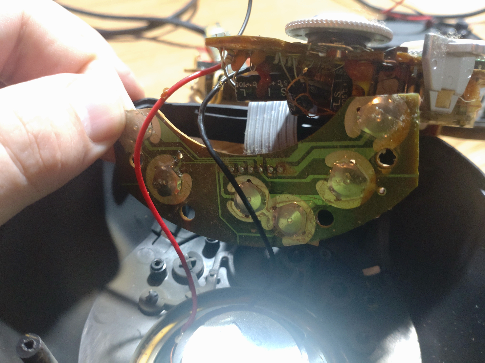

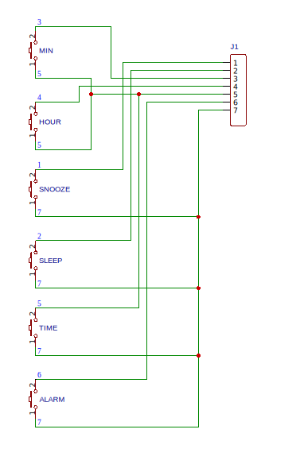

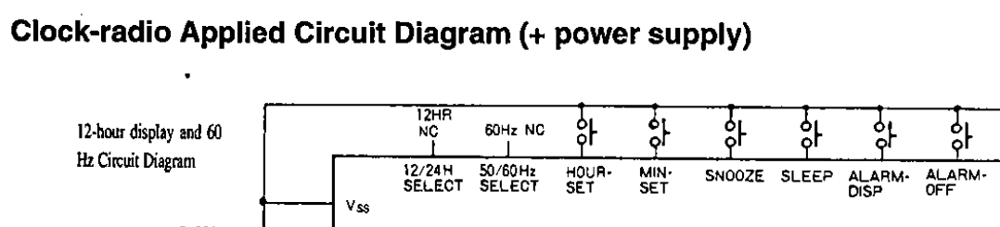

## Display

## Speaker

The speaker, while it's the most important part of this project, it's not very interesting. It's just an inexpensive 0.5 W 8 Ω speaker.

I connected a tiny LM386 based amplifier to test if it's still working. It sounds a bit crude, but it is indeed capable of emitting sound. I'm not sure if I'm going to keep it, or find a replacement for it, that might sound better. 
That problem is for the future. I'm also yet to figure out which amplifier and how I will use, will it be an off-the-shelf board or maybe hack up something? I don't know yet.

# Conclusion

And that concludes the first part of my new alarm clock in the making. 
I've decided to write blog posts about it as the project progresses, so maybe I can go into more detail in each post, and maybe I'll actually write them and not just start them and never finish them.  

This post really is just a first step for this project. As I proceed, I plan to post more updates about it, and try to keep them a little shorter.

Thank you for reading!

# Extra: Fun facts

Of course, I found some interesting things in my search for the perfect radio alarm clock, but I didn't want to make that part any longer. So here they are...

## Other models

Apparently, this radio alarm clock was sold under different brands than Tesco Value.

There is a brand that is unknown to me that seems to have sold the exact same clock without any modifications.

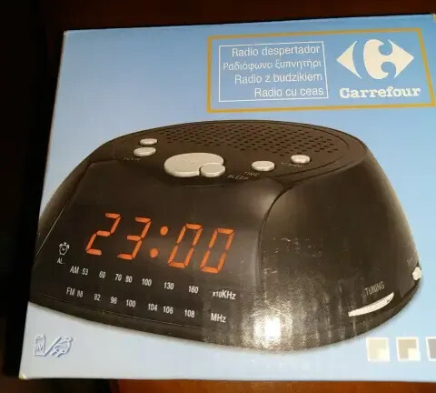

Also, a little more known brand, Elta seem to have their own version of this radio alarm clock, but they did a twist on the colors as well.

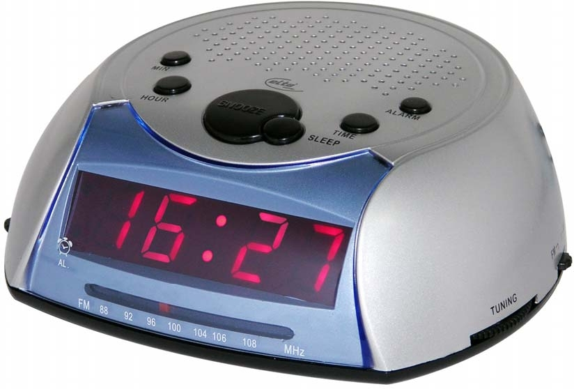

## The updated model: CR106R

It seems like there was an updated version of this radio that featured a digital tuner. I found less online listings for it, so I assume It wasn't as popular. I found the manual for it, however.

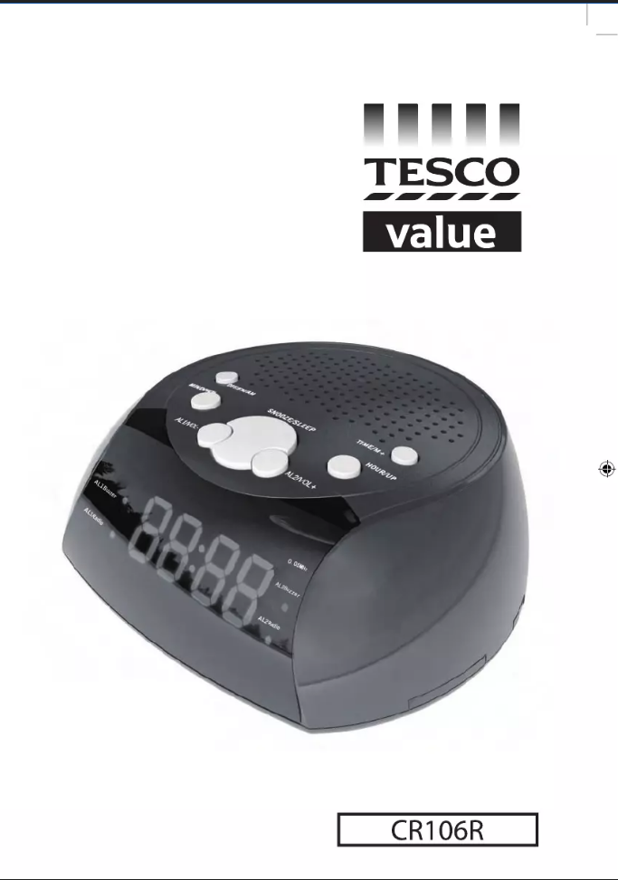

At first glance, it looked very similar to mine, except for the extra button on the top. I guess that was added because there was a need for an extra button to adjust the volume, and the extra alarm option was just an afterthought.  
They seem to have changed very little in the manufacturing process of the case. The holes for the dials and switches on the side are covered up instead of making a new shell (so I assume the hole for the extra button on top is also drilled into existing cases).

However, they have changed the internals. The display must have been changed because there is no segment in the place of the "AL2Buzzer" on the display for the CR-106.
Also, according to the manual, it needs 2xAA batteries instead of the 9V battery for the time backup.