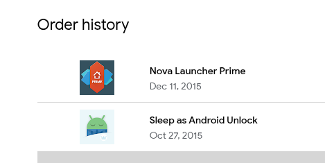

So, it all started with a [Stanford Lifestyle Medicine article](https://longevity.stanford.edu/lifestyle/2024/05/30/what-excessive-screen-time-does-to-the-adult-brain/) about "What Excessive Screen Time Does to the Adult Brain".
You wouldn't have guessed it, but it's not healthy! I know, I know, this groundbreaking discovery probably won't change the world on its own. The awesome thing about this article however is that it actually gives you some advice on how to improve your life in this regard.

Their advice, which I took by heart, is "No Screen Time for the First Hour of the Day". Actually, they recommended this as a practice for a month, but I'm actually doing this practice for half a year now.
I won't say it changed my life or anything, it's just something I've been doing ever since. I've been also thinking of stepping up my game for a while: **baning smartphones from the bedroom altogether**. 

I'm thinking of setting up a nice charging station somewhere outside and leaving my phone there while I sleep. I could also get some nice bedroom lamp, and maybe read a book or something instead of being on my phone before sleep.
But there's one thing that prevents me from doing that...

# How do I get up in the morning?

Yes, that's right. Ever since I had a mobile phone (not even a smartphone), I'm using it as my alarm clock.
This is the most reliable way to wake me up. It has an internal battery, so it works during power outages. It synchronizes its clock to the network, so it will always alarm on time. It's portable and I can even choose the alarm sound.

It's really just the perfect solution for waking someone up. There was even quite a long period of my life, while used sleep tracking.
I purchased [Sleep as Android](https://play.google.com/store/apps/details?id=com.urbandroid.sleep) in 2015 and used it just until a few years ago.

I no longer use sleep tracking, but their little puzzles that you have to solve to turn off the alarm are pretty clever, and I still use this feature. 
Sometimes I'm having a super hard time waking up. Since I overslept some of my meetings in the morning (which were super embarrassing to me), I have an NFC tag in the hallway that I have to scan to stop the alarm. (I used to do "simple maths" before, but as it turned out, it just helped me develop the ability to do maths in my sleep.)

So using a smartphone (or even a dumb phone) to wake me up is just the best thing I could have, but sadly it conflicts with my plan above. So I've got to look for an alternate solution.

# The Issue With Commercial Alarm Clocks

- why do I need
- they does not run Linux

- in this series...