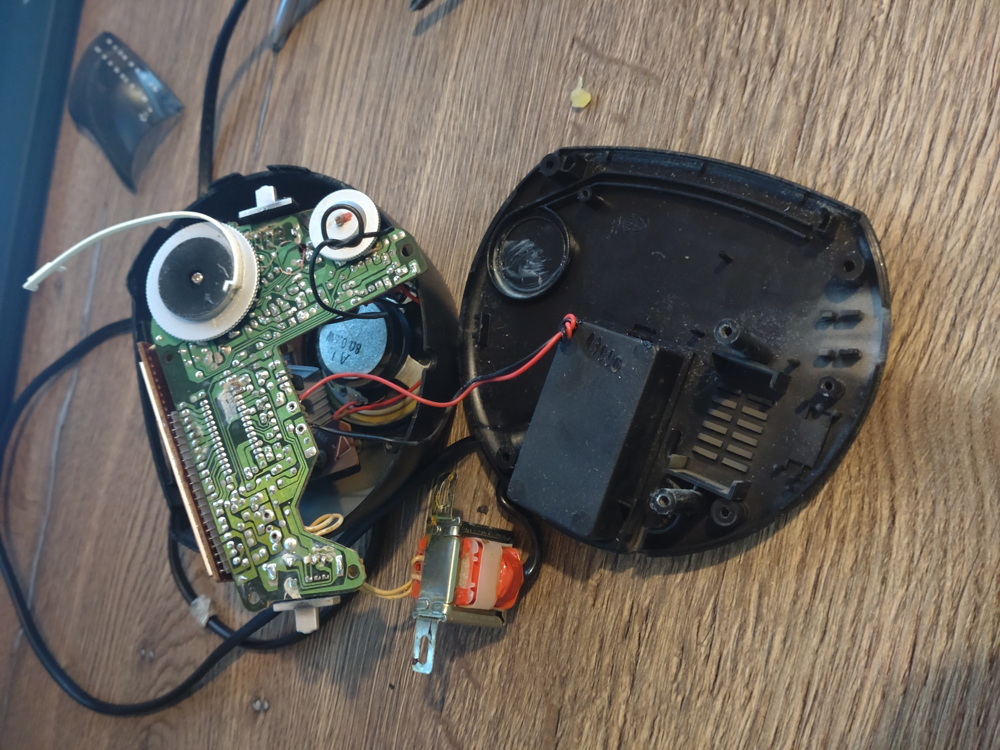
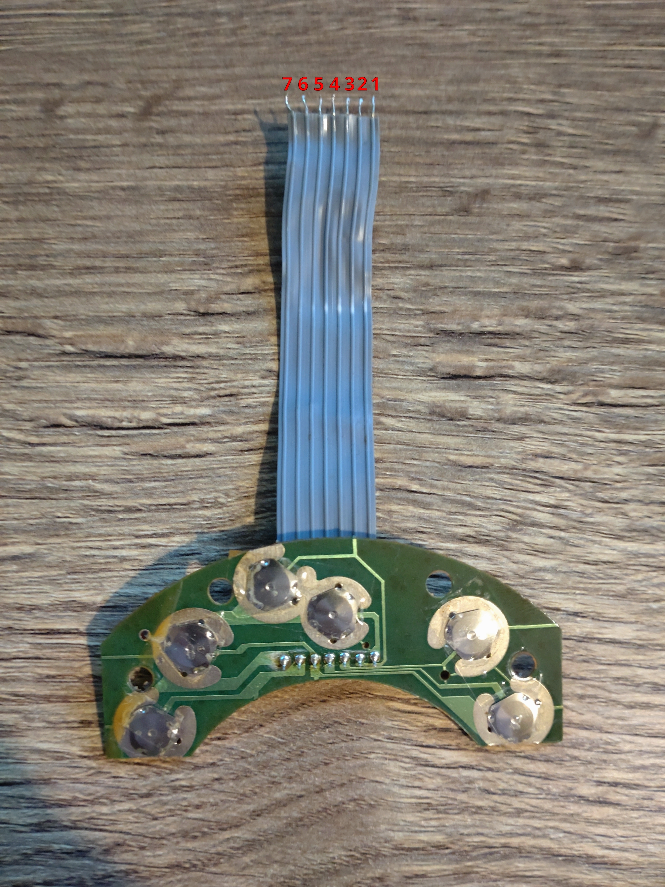
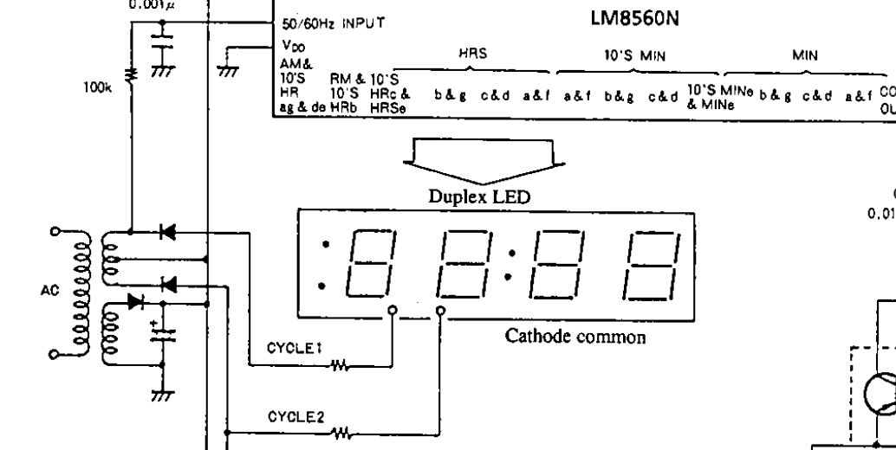
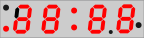
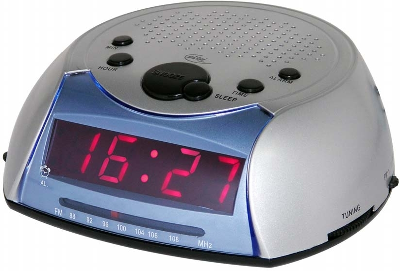

<!-- cspell:ignore Cellux Elta-->
So, it all started with a [Stanford Lifestyle Medicine article](https://longevity.stanford.edu/lifestyle/2024/05/30/what-excessive-screen-time-does-to-the-adult-brain/) about "What Excessive Screen Time Does to the Adult Brain".
You wouldn't have guessed it, but it's not healthy! I know, I know, this groundbreaking discovery probably won't change the world on its own. The awesome thing about this article however is that it actually gives you some advice on how to improve your life in this regard.

Their advice, which I took by heart, is "No Screen Time for the First Hour of the Day". Actually, they recommended this as a practice for a month, but I'm practicing it for half a year now.
I won't say it changed my life or anything, it's just something I've been doing ever since. I've been also thinking of stepping up my game for a while: **baning smartphones from the bedroom altogether**.

I'm thinking of setting up a nice charging station somewhere outside and leaving my phone there while I sleep. I could also get some nice bedroom lamp, and maybe read a book or something instead of being on my phone before sleep.
But there's one thing that prevents me from doing that...

# How do I get up in the morning?

Yes, that's right. Ever since I had a mobile phone (not even a smartphone), I'm using it as my alarm clock.
This is the most reliable way to wake me up. It has an internal battery, so it works during power outages. It synchronizes its clock to the network, so it will always alarm on time. It's portable and I can even choose the alarm sound.

It's really just the perfect solution for waking someone up. There was even quite a long period of my life, while used sleep tracking.
I purchased [Sleep as Android](https://play.google.com/store/apps/details?id=com.urbandroid.sleep) in **2015** for that purpose.

I no longer use sleep tracking, but their little puzzles that you have to solve to turn off the alarm are pretty clever, and I still use this feature.
Sometimes I have a really hard time waking up. Since I overslept some of my meetings in the morning (which were super embarrassing to me), I have an NFC tag in the hallway that I have to scan to stop the alarm. (I used to do "simple maths" before, but as it turned out, it just helped me develop the ability to do maths in my sleep.)

So using a smartphone (or even a dumb phone) to wake me up is just the best thing I could have, but sadly it conflicts with my plan above. So I've got to look for an alternate solution.

# Getting an Alarm Clock

The _easy_ solution to this problem would be to just buy any alarm clock, put it on my bedside table and call it a day. But that would be the most boring solution imaginable.

You see, I can't just buy _any_ alarm clock. If I'm going to get one, I need one that is specifically tuned for my needs. And that need is the need for running Linux. (Also the things I described above would be nice to have.)

So the only logical thing to do here is to ignore the market altogether, go ahead and design and build an alarm clock that ticks that all-important box, and maybe some others too.
(It's possible that there are clocks out there that would probably meet my needs, but there's no stopping now.)

I expect this project to take up years, if not months. So instead of writing a post about it at the end (as I try with most of my projects), I try to write about it each time I hit a noteworthy milestone.

This post marks the first milestone, where I get a neat shell for my project.

# The Tesco Value CR-106 clock radio

When I was a kid, and I didn't have a mobile phone (or I didn't use it as an alarm clock, I can't remember). I had this exact model of a radio clock.

I remember going to the nearest Tesco, with my saved money. There was a shelf full of radio alarm clocks. This one was at the end of the line, the cheapest option. They sold it in the usual white-blue "Tesco Value" box.

While it wasn't really the nicest option, I still remember this clock as "The radio alarm clock" that I had, and when I think about a "radio alarm clock," this comes to my mind.

Sadly, I no longer have mine, still I decided I want something that looks like this. The best way to achieve this (to me) is by getting one and modifying its internals.
At that time I didn't remember anything else about it aside from how it looked like, so I searched the local and online markets for one, but none of the ones I could find were to my liking.
Until eventually, I discovered that this was "The model," and after that, I could finally look for it.

I managed to find it at an online second-hand marketplace, for a few thousand local currency (that's actually not that much here), so I picked it up. It was mostly functional, a bit dirty (the picture above was made just when I got it home), the buttons were a bit hard to press, the radio sounded very crunchy, and it was missing its antenna.
But it was there! I was delighted about it. It brought back some of my childhood memories.

# Disassembly

So it is time to tear it down, so we can use its shell for _a greater purpose_, and maybe some of the internal components.

Fortunately, it is quite easy to take this thing apart. From the bottom there's only four screws holding the top piece to the bottom part. Take those out and the top can be lifted off.

But lifting off the top does not get us very far, as there a few are wires holing us back. One goes to a PCB on the top, which is for the buttons on the top, the other one is for the speaker.

The transparent part can be taken off easily when the top is lifted, it's not glued or screwed to anything.

Peeking inside the machine, we can see that there is a main circuit board which seems to hold all the important parts. This board is held in with two more screws.

The PCB has some typical radio parts on it, like the ferrit rod antenna for AM reception, the variable capacitor thingy for tuning, and other stuff. Pretty typical cheap radio setup going on here, nothing unusual.

There is also a (relative to modern things) big transformator. Indeed, no fancy switching power supply here.
There are also four identical looking diodes next to a large capacitor on the main board. I assume this is how the DC power is produced for the parts requiring it.

Looking at the main board, I noticed that there is an IC on it (actually there are more, but they're not that interesting)! I was curious what it does. According to the label on it, it's a _LM8560_.

I checked its datasheet to find out more about it, and I've got to say, it is a charming little chip. Check this out:

Yes, it's an alarm-clock-on-a-chip! Isn't this cool?!

Scanning through the datasheet, revealed me that really all the features of this device (except the radio part) are implemented on this single chip.
It literally does everything, from handling the backup battery, through generating the alarm tone (yes, it can do that. Instead of turning on the radio, it can also beep in the morning) to driving the LED display.

It takes the 50/60&nbsp;Hz frequency from the powerline and uses that as the time reference, but it also uses that signal to other things, like driving the common cathodes of the duplex LED display.

It's a nice chip. I assume that it found its way to many other low-end alarm clocks, that I never heard of. It's also nice that we have the datasheet, because it will serve as a great reference for figuring out other parts of the clock.

Moving on, removing the screws and the transformer allows us to remove the main board from the bottom.

At least I hoped for that, as there are also a pair of wires that are holding it to the bottom. Which is for the battery compartment at the bottom.

All the wires I mentioned earlier are soldered to the main board. No connectors or anything like that. This is pretty typical for these inexpensive electronics of the era.

I usually try to be the least destructive possible, so I decided to de-solder all the wires instead of cutting them. I'm not sure what kind of solder they used, but it was surprisingly easy to do so. At 280°C, the solder melted just fine.

I de-soldered the speaker and the battery connector, then unscrewed the top PCB for the buttons, and with that I could finally remove most of the internals from the case.

There is one last thing that needs to be removed from the case (mostly for cleaning reasons), that is the speaker.

They used that ugly yellow glue, I just call "radio glue" to hold the speaker. This is the kind of glue that was put on everywhere on all electronics in this era, for seemingly no other reason than just making repairs harder.
I'm not sure what exactly that is, so I'm not exactly sure what should dissolve it. I also shouldn't experiment as I might risk damaging the plastic of the shell (Like I did later...), so I resorted to scraping off the glue in hope of freeing the speaker.

Eventually I managed to scrape off enough for it to come loose, and I could finally remove it.

I'm glad I did that, and looking at the picture above, I might not even have to explain why.

After that was done, I gave a bath for top shell, the buttons and the transparent part, in warm soapy water.

For the bottom part, I didn't want the stickers to come off, so I cleaned it with a brush and wet wipe, it came out just as well.

After drying it out, I put together the empty shell to see how it looks. I'm satisfied with the result.

**WARNING:** As I couldn't get all the ugly yellow glue off by scraping, and I didn't want to scrape the plastic too much, I started experimenting with some chemicals to remove it.
**This was a bad idea!** I thought isopropyl alcohol can do little harm, but as it poured to the other side, and I wiped it, it seems like I wiped of some black paint.
Since I didn't notice this at first, I kept wiping and when I realized what I've done, the top looked super-ugly... I was sad and mad of how stupid I was...
I had no idea that the top was painted, but guess I know it now.

Luckily, I found out that I could restore it to its original look with black shoe polish and some careful rubbing with a towel. After letting it dry, it looks good now. I have to be more careful from now on! Of course, the glue didn't budge.

# Re-using parts

Like I mentioned before, instead of replacing everything inside, it would be nice to keep some parts and reuse them. This would not only let me keep the original feel, but should also make my job easier.

Along with the battery terminals and the speaker, I also de-soldered the LED display and the top PCB that holds the buttons.

Now that I have all these parts. It's time to explore them in detail, and figure out what worth saving.

## Top Buttons

Honestly, I hoped for some micro-switches as it would be straightforward to replace and keep the board intact, but we are dealing with cheap electronics here, and cheap electronics come with cheap solutions.

What we have here instead are metal dome switches, taped on the PCB with what looks like Cellux tape. This sure will be fun to refurbish. As I mentioned earlier, the seller told me that they are not very reliable. So I have to try to do something about that.

The board has a seven-track ribbon cable. That's great, I assumed it would just have one common wire and one wire for the "other side" of each button. That would be the easiest to work with.
After inspecting the traces, however, and checking my assumption with the continuity function of my multimeter. Turns out it's not that simple.

Pin 7 is the common line for the majority of buttons, except for `MIN` and `HOUR`, which both seem to use pin 5 for their common line. This is strange, because pin 5 is closed to pin 7 by the `TIME` button.

Frankly, this arrangement had me scratching my head for a while. And when I looked at the datasheet of the LM8560 IC, I was even more confused. I could not see what could be the reason for this fun arrangement.

Then I realized... While there are six pins on the IC, and six buttons on the top, they are not the same. There is no "Alarm-off" button on the top, that one is actually connected to the switch on the side of the clock, that one can use to... well... turn off the alarm.
There is also no button input on the IC to "enable" the clock setting, but you can still only set the time while holding down a key to do so. This is solved by having the other side of the time setting buttons connected to the common **trough** the button that allows time setting.

So what we have here is actually an "and gate," the `TIME` button has to be held down to allow the `HOUR` and `MIN` buttons to set the time. This is not implemented by the IC, but instead it's wired like that on the top board.

I wonder if this will be a problem in the future or not, but either way, I need to keep this in mind when designing the new functionality of the buttons.

## Display

The display is a very iconic part of digital bedside alarm clocks of this era. A nice red 7-segment display with just enough digits and some extra segments for everything. It really gives the vibe I'm after. The display used in this product is a duplex LED display with common cathode and 19&nbsp;mm x 72&nbsp;mm in size.

This duplex thing was new to me, but it just means that it has more than one cathode, and the anodes are shared between two or more segments, no black magic here.

What was interesting to me is that the cathodes seemed to be connected to the output of the transformer (trough ~&nbsp;50&nbsp;Ω resistors). And indeed, looking at the application circuit from the LM8560 datasheet, this is what they recommend.

Now that we know some basics, it's time to figure out what are the "capabilities" of this display. To do this, I checked the traces on the main board, and compared it to the chip's datasheet. I've also done some testing with powering the pins of the display, to see what lights up.

Thankfully, it was quite easy to figure out all that I needed to know. But there were some segments that no matter how I tried, I just couldn't light up. I tried all pins in all combination (checked the pins that have no ribbon cable attached as well), but no luck.
Some segments just do not seem to be wired up internally. It seems like the board under the leds is made for this very application, and it's not generic.
I marked the "working" segments on the following figure.

All the segments that are actually used by the radio clock will light up, but no others. The first digit only displays `1`, `2` or nothing, so they didn't need the top-left segment, so they spared it.
I created a table to kind of illustrate how this LED display is wired up internally.

Actually, this display has three cathodes. I assume the third was added for the "non-standard" segments (but it isn't really used here). They are the first 3 pins, so I'll identify them by this.
I'm also using [the standard labels for the 7-segment display segments](https://commons.wikimedia.org/wiki/File:7_segment_display_labeled.svg). 

| Pin | Digit with Cathode 1 | Digit with Cathode 2 | Digit with Cathode 3           |
|-----|----------------------|----------------------|--------------------------------|
| 4   |                      |                      | Alarm indicator at bottom left |
| 5   |                      |                      |                                |
| 6   |                      | 10's hr B            |                                |
| 7   | 10's hr A            | 10's hr G            |                                |
| 8   | 10's hr D            | 10's hr E            |                                |
| 9   | Hr E                 | 10's hr C            |                                |
| 10  | Hr G                 | Hr B                 |                                |
| 11  |                      |                      |                                |
| 12  | Hr D                 | Hr C                 |                                |
| 13  | Hr F                 | Hr A                 |                                |
| 14  |                      |                      |                                |
| 15  | 10's min A           | 10's min F           |                                |
| 16  | 10's min B           | 10's min G           |                                |
| 17  | 10's min C           | 10's min D           |                                |
| 18  | Min E                | 10's min E           |                                |
| 19  | Min G                | Min B                |                                |
| 20  | Min D                | Min C                |                                |
| 21  | Min F                | Min A                |                                |
| 22  | Colon                |                      |                                |

That's about it for the display.
I'm a little disappointed, because when I first saw it, I was hoping to be able to illuminate all the segments on it, so I could put more information on it. However, now It seems like I can't even write `boot` on it.
I could probably wire up the missing segments if I tried to disassemble the display, but the plastic is fused to the board, so it definitely won't be easy.
I also need the ability to dim the display, so it's not so bright at night. PWM on a duplex display seems to be a bit complicated though.

With all that in mind, I'm not sure if it's worth keeping the display as it is, or I should be looking for a replacement that's easier to drive and can display more.
The only reason to keep it is that it seems inconvenient to make a replacement that fits perfectly.

## Speaker

The speaker, while it's the most important part of this project, it's not very interesting. It's just an inexpensive 0.5&nbsp;W 8&nbsp;Ω speaker.

I connected a tiny LM386 based amplifier to test if it's still working. It sounds a bit crude, but it is indeed capable of emitting sound. I'm not sure if I'm going to keep it, or find a replacement for it, that might sound better.
That problem is for the future. I'm also yet to figure out which amplifier and how I will use, will it be an off-the-shelf board or maybe hack up something? I don't know yet.

# Conclusion

This concludes the first part of my new alarm clock in the making.
I've decided to write blog posts about it as the project progresses, so maybe I can go into more detail in each post, and maybe I'll actually write them and not just start them and never finish them.
Maybe I should keep them a little shorter though.

Thank you for reading!

---

# Extra: Fun facts

Of course, I found some interesting things in my search for the perfect radio alarm clock, but I didn't want to make that part any longer. So here they are...

## Other models

Apparently, this radio alarm clock was sold under different brands than Tesco Value.

[There is a brand that is unknown to me](https://www.wallapop.com/item/radio-despertador-511546335) that seems to have sold the exact same clock without any modifications.

Also, a little more known brand, [Elta seem to have their own version of this radio alarm clock](http://www.hifi-forum.de/themen/produkte/elta/4218-n), but they did a twist on the colors as well.

## The updated model: CR106R

It seems like there was an updated version of this radio that featured a digital tuner. I found less online listings for it, so I assume It wasn't as popular. [I found the manual for it](https://www.manua.ls/tesco/cr106r/manual?p=2), however.

At first glance, it looked very similar to mine, except for the extra button on the top. I guess that was added because there was a need for an extra button to adjust the volume, and the extra alarm option was just an afterthought.  
They seem to have changed very little in the manufacturing process of the case. The holes for the dials and switches on the side are just covered up (so I assume the hole for the extra button on top is also just drilled into existing cases).

However, they have changed the internals. The display must have been changed because there is no segment in the place of the "AL2Buzzer" on the display for the CR-106.
Also, according to the manual, it needs 2xAA batteries instead of the 9&nbsp;V battery for the time backup.
