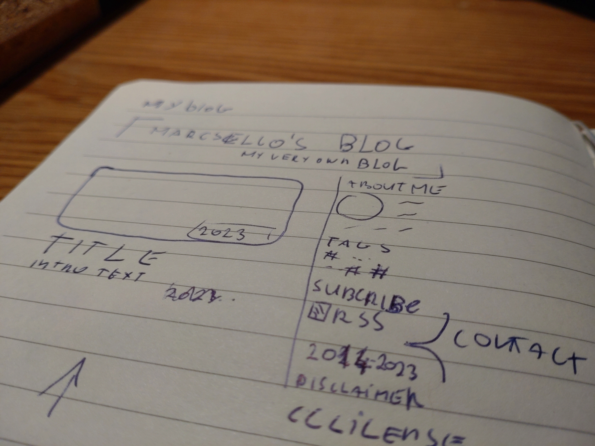
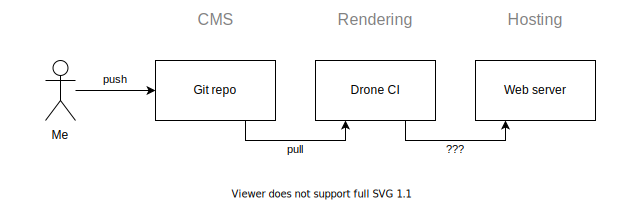
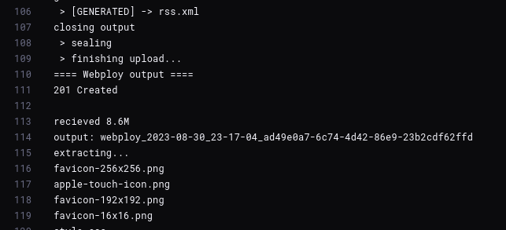

So I've been thinking for a while of creating this blog. But I tend to over-engineer my ideas, which usually result in me planning and designing things for weeks and ending up not building anything.
To avoid this, I've decided to keep things at a minimum this time, so that I could actually come up with an [MVP](https://en.wikipedia.org/wiki/Minimum_viable_product) and improve later. 

All I want now is to write cool [Markdown](https://en.wikipedia.org/wiki/Markdown) files, with some metadata, maybe include some pictures, and turn all this into a pile of HTML and CSS. Fancy things can come later.

But if that was all for it, it wouldn't really make sense of writing a whole blog post about it. So, let's see how could I still sneak in some pointless engineering to such a simple thing.

# Useful abstraction: The CMS

The Content Management System (or CMS for short) is actually a pretty vital part of every website that's primary focus is to share information in a somewhat unified fashion.
Think of any news outlets, it would be very unconventional for every writer to edit the HTML code of a page to publish their article. And it would be even more of a nightmare to run such a site.

So we need something inbetween, where at one side, writers can focus on writing their posts without even thinking of what's going under the hoods. And something for the site builders, that function as a text repository that they can use to fill up their website with content. This is where CMS comes into play!

There are at least a hundred CMS solutions out there, both that include the site rendering functionality (such as [WordPress](https://wordpress.org/), [Drupal](https://www.drupal.org/), [Joomla](https://www.joomla.org/), [e107](https://e107.org/), etc.) and without it (such as [Strapi](https://strapi.io/), [Keystone](https://keystonejs.com/) and [many others](https://jamstack.org/headless-cms/)...). Those are so-called [headless CMSes](https://www.netlify.com/blog/complete-guide-to-headless-cms/), and the cool thing about them, is that you can basically build any solution on them, to render your website exactly how you like. And as the tinkerer I am, this is something I love.

_But, how simple can a CMS really be?_

Well, if you think of it... even a simple Git repository can be a CMS, right? You can place the article texts in neatly organized folders, along with some metadata and other assets for that post. It's not just super-simple but allows having some great features at no cost! With Git, you can have commits, branches, synchronization at ease, and what's possibly the coolest is that you can use all the other awesome tools built on Git as well... like free public hosting such as [GitHub](https://github.com/) or [GitLab](https://gitlab.com/), CI/CD solutions, Issues, Comments, Pull/Merge requests, enhanced collaboration tools, IDEs and many others. Those are features that even the paid CMS solutions sometimes fail to deliver properly (to be fair, most of those rarely needed in the publishing industry). It's a marvel of a simple solution that can be extended to infinity and beyond.  

_And that's exactly what I need!_ 

As a developer I'm already familiar with these tools. And I love the idea of having this many possibilities to experiment with. While a blog's main function is to deliver articles to its readers, this is still a project of mine, and as such, I want to have fun building and maintaining it to unreasonable levels...
If I were tasked to build something for a publishing collective, I am most certain that I would take a different approach.

# Problems I've invented for myself

Like I've mentioned before, just because I want to keep things at minimum that does not mean no-fun allowed.

So this is basically the ideas I had for the current design:
1. I want to store the posts in Git, using cool Markdown files.
2. I want a static website: less moving parts = fewer problems.
3. It would be cool to also have a CI pipeline to render the site for me.
4. While we are already at it, we could just store the renderer/builder thingy along with the posts in the same repo, so the same pipline can run for both post changes and changes in other parts of the site.
5. I obviously want to create my very-own website renderer/builder solution. No turnkey solutions here, only coding!

It would be very a very unethical move from me to state that I come up all this by myself. In fact, I've already helped in building a [site](https://quotes.kszk.bme.hu/) that works basically the same (only with some slight differences). So it might be possible that I take inspiration from that previous work. 

The above sounds like a plan to me. Since I kept things at minimum, I could code all this in a few afternoon and get to writing posts super quick. Only one piece was missing from the puzzle. 

That's right. I've left the best part to the last. Figuring out how to get the final website built by the CI job uploaded to the web server...

# Publishing a static site from a CI job

First, I would like to mention a few possible solutions. If this wasn't for my blog, I would probably go with one of these solutions. This is not meant to be an exhaustive list, just to showcase some possibilities. There are obviously more/better solutions and some of these can even be combined.  

## FTP

One of the oldest, and possibly the lamest solution would be to use FTP to transfer files that make up the site. It's reliable, still widely used, and boring.

Possibly the biggest drawback of this solution is the lack of other interactions than file transfer. It may be nice to trigger some scripts on the webserver too, but it's not a necessity at all...

## SSH

I've seen solutions elsewhere where the CI job used SSH to log in to the server that hosts the content and transfer the files with either SCP or SFTP. 
It's an okay solution because you can restrict users to specific commands, so along with file transfer you may also execute some commands from the CI job that is needed on the server side for your changes to go live.

But it requires a restricted user to be set up on the server, with strict controls and hardening in place... and honestly, I'm having mild shivers from any automation doing things trough SSH.

## Use some sort of registry

In my humble opinion there are two ways of doing this. The "meh" way and the "non-existent" way.

One approach is to invite our cool friend Docker to the party. Take the rendered content and a generic [nginx](https://hub.docker.com/_/nginx) (or any http serving) base image, and "build the content into it", by simply [ADD](https://docs.docker.com/engine/reference/builder/#add)ing it. This way you can have a simple container image that you can upload to any Docker registry (including [Docker Hub](https://hub.docker.com/) which is somewhat free for public images). And use the plethora of already existing tooling to host it literally anywhere.
I consider this the "meh" solution. 

This solution means packaging a software binary along with your static website. This is exactly what I want to avoid. Having something runnable requires maintenance to keep it secure and up to date. I would have to rebuild and re-deploy this image sometimes even when the content did not change. And this also results in a "big" container image. Since it wouldn't be easy to take advantage of layers, every deployment would mean pulling the entire website content every time. This is not an issue with most other solutions discussed here (especially not with a small blog like this), but the Docker world is a bit different. And on top of all that... it just feels meh to use Docker like this.    

Another approach would be just to package up all the files into an archive and put that into a registry of some kind, and have the webserver to pull the content from here, extract and serve it. I consider this the "non-existent" way, because I really can not find any know-how or other existing solutions around this. I know there are registry/repository solutions (like [Nexus](https://www.sonatype.com/products/sonatype-nexus-repository)) that can host arbitrary artifacts (even S3 could be used this way). But haven't seen anyone using anything similar to deploy static sites. 

But that never stopped me from engineering my own weird solution to something. It's just not the path I choose... possibly because I don't have a registry set up anywhere, and I don't want to host one just for this project (and don't want to pay for it either...).

## Use GitHub/GitLab pages

I'm not really familiar with these, but by reading the [documentation](https://docs.gitlab.com/ee/user/project/pages/getting_started/pages_ui.html), it seems to be possible to host the artifact built from a CI job on them using their own CI solutions. 

The problem with this is that it would solve the problem way too easily. Also, a smaller problem is that it seems like that they require their own CI solutions to be used, which is not good, since I want to use my own self-hosted Drone CI instance for that purpose.

## Use S3 or similar to host the site

Most S3 providers support [hosting your static site directly from an S3 bucket](https://docs.aws.amazon.com/AmazonS3/latest/userguide/WebsiteHosting.html). It doesn't seem complicated to set up something like this on my own, so I wouldn't even have to pay extra for it.   

But we are getting off-track with these good solutions here... 

# Publishing my static site from a CI job

That's right, I need something different!

Since I feel like, in 2023 everything is about HTTP based services, and HTTP APIs. Why not build something that can upload the website contents using HTTP? We have the `POST` method for this exact reason, right?
Since we are having a **WEB** server here... solving our problem tough HTTP feels just right! No extra protocols, no tedious hardening just a simple upload over HTTP... well almost.

The problem is not solved here... HTTP only gives us a way to communicate, we still have to decide how and what should we communicate over it.

This blog (like most static websites) is made up of multiple files. This itself is not a problem, we could upload each file individually, but that uploading method itself is a problem. What if the script crashes in the middle of an upload? Or what if the webserver is restarted? Or maybe someone opens the website while a piece of content is still being uploaded? To mitigate all these issues, we would need some sort of [transaction](https://en.wikipedia.org/wiki/Transaction_processing). The website content should only be replaced once the rendering is completed and all files were uploaded successfully.

I thought of some solutions that utilize multiple HTTP requests to achieve proper transaction handling... then I realized... why not just stuff everything in a single `POST` request. If this request goes through without a problem then the transaction is succeeded and the content should be updated, if not... then not.

_But how to pack many files into the body of an HTTP request which is basically just a single binary stream? (please forget that [Multipart](https://www.w3.org/Protocols/rfc1341/7_2_Multipart.html) ever existed)_

Wait!... Isn't this what archives are for? Right! We could just pack all files into a single archive and upload that in the body of the HTTP request. If we use a streamable archive type like ["tape archive" (TAR for short)](https://en.wikipedia.org/wiki/Tar_(computing)) we can even pack the files on the fly, as they are rendered. This would save us from having to render all files to disk, pack them up and upload them. 

[This is exactly what I've done!](https://github.com/marcsello/blog/blob/760af59b0648843ac7dbcb84edba0c970149a446/builder/output.py#L93-L194) When the builder script starts, it opens a request to the webserver, and stream everything as part of a big tar file. For the server side I've quickly hacked together a shell script to run by [webhook](https://github.com/adnanh/webhook), that receives the data, unpacks it, checks if it's alright and then updates the website contents. It uses a simple pre-shared key for authentication.

And I've given all this the cheesy name "Webploy".

It's still far from perfect,... I had to do some shortcuts and hacks to get it working from less effort. Like adding an empty file to the end to signal completion and the lack of any other integrity verification. But I'm satisfied with the result, and I can always improve it later.

# Conclusion

Do I recommend this solution to anyone? It depends on who's asking.

If you're looking for a rock-solid, cloud ready, enterprise solution... don't ever think of doing this. But as a hobby project this was quite fun to tinker with.

If you are more interested in the implementation details, you can find the client-side implementation in the blog's source code: [permalink to the last commit as of writing this post](https://github.com/marcsello/blog/blob/760af59b0648843ac7dbcb84edba0c970149a446/builder/output.py#L93-L194). The server-side script is currently the ugliest thing possible, so I'll only share it once I've rewritten it, or come up with an even better solution.