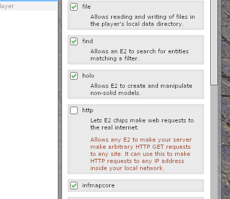

This is one of those posts you can't really appreciate without having part of your childhood spent on building weird contraptions in [Garry's Mod](https://store.steampowered.com/app/4000/Garrys_Mod/) with some cool [Wiremod](https://wiremod.com/) bits.
I was one of those kids. Sometimes, while I was in the middle of building the most advanced machines I could think of, I found myself running out of keys on my keyboard to control them. Therefore, I was constantly thinking of how could I add more ways of input to the game. 

This thought still bugs me today. Not because I'm still in a huge need of extra buttons, but rather because I'm intrigued by the problem itself.
I'm definitely not playing as much as I used to, but out of nostalgia, I picked up the game again recently, so this  perfect weekend project.

Sure, you can hook up a joystick to your computer, and Garry's mod being a source game, would probably support using it with Wiremod stuff, but that's just about 10% interesting.

# Wiremod and input

For those who does not know Wiremod, really should check it out first, because you wouldn't find this post interesting at all otherwise.
For those who know it well probably does not need explanation on what is it, so you can skip to the next chapter. But for those who does not belong in either of these groups, may proceed reading the next few paragraphs. 

Wiremod basically adds an imaginary electronics architecture to the game. It lets you spawn sensors, actuators, a diverse set of input and output things, and various sorts of control devices.
But as the name suggests, the most powerful part of all these are wires! You can wire all these in any way you want. 
All wire devices have inputs and outputs, often multiple, and you can choose how you wire those to your liking.
Wires may carry multiple types of data, like numbers, strings, or even vectors and many other cool data structure.

 TODO: image of advanced wire contraption.

So basically anything you build will rely on passing data on wires. 
Therefore, if you want to add an extra way of "input" to the game, all it has to implement are just wire outputs that represent what you provide on that "input", and you are all set.

A cool thing Wiremod introduces (among its plethora of cool stuff) is Expression 2 (E2 for short)! Expression 2 basically lets you create custom chips in the game, with any sort of inputs and outputs and lets you run any custom code on that chip. 
It has its own coding language that implements various functionality that lets you read and manipulate those inputs, and control those outputs.
But it does not stop just there, it has many other neat features like manipulating the physical world, spawning or breaking props, accessing the chat, etc.

Although it's capabilities to communicate with the outside word is pretty limited. 
It does implement one "extension" that restlessly tickles my fancy: **It's ability to make HTTP requests to the outside world.**
See where this is going?

# The HTTP capabilities of Expression 2

Sadly the `http*` functions this "extension" provides to E2 are very limited and poorly documented. So I had to do some digging and investigation.

Basically E2 can only make `GET` requests, and you can only set the URL for the request.
After the request has been made, you only get a single "boolean" (Wiremod does not actually have boolean, it uses number for that as well; fun fact: all numbers are floating point) to indicate if it was successful, and you can only obtain the response body as a string. 
No headers, no other verbs, no HTTP status, no fancy options like timeout, but at least it supports HTTPS.

The other problematic part of the E2 HTTP methods that they are rather costly (especially if you want to parse JSON). So rapid polling of something is completely out of question. 

So we are stuck with a slow and costly way of state updating... but wait! **Maybe we can implement long-polling!**

Long-polling is basically just starting a long-lived HTTP request and having the server hold up the connection until something happens (or close it after a certain timeout). 
By utilizing long-polling we can receive the "events" as soon as they occur (plus network delay) without wasting resources. 
It seems like we could make this work somehow. 
We just need to make sure that we can open long-lived requests from E2. 

# Expression 2 and long polling

To test the long-polling "capabilities" of E2 I've [quickly hacked together a tool](https://github.com/marcsello/longPollTester) that starts an HTTP server and measures how long can a client keep up the connection. 
I've started this tool on my computer, launched Garry's mod, started a single-player game to do some testing. 

First, I've learned that for some reason E2 refuses to make requests towards `127.0.0.1`, but I've quickly overcome this by using the DNS name of my computer (fun fact: this is an [intentional limitation](https://wiki.facepunch.com/gmod/http.Fetch), but it seems like it's implemented badly). 
Second, I have found out, that you indeed can not do rapid polling, as there is an approximately 3-second delay after each request when you are not allowed to make another one.

Regarding the long-polling capabilities, after some measurements it seems like I can reliably run requests even as long as 10 minutes (and possibly above that, but that would take too much time to test).

I have also discovered, that connections does not get closed after you delete the E2 chip. 
I could only terminate the connection by quitting from the game. 
So the server must close the connection eventually or the game will keep up the connection indefinitely, as there are no way to manually interrupt a pending HTTP request!  

But the initial success in single-player didn't hold up much in multiplayer. 
On my own server with default settings, **I couldn't make a request that lasted longer than 1 minute**. 
When I went above just a few milliseconds, the request became unsuccessful. 
This isn't great... Firing an HTTP request every 63 sec could be considered spamming by some administrators, which may lead to consequences.  

I was also curious how would multiple E2 chips affect each-other.
And strangely enough, they did disturb each-other, but instead of the 3 second delay, it seemed initially that the individual chips had to wait a lot longer to get a chance to make a request. 
But after a few minutes these delays normalized, and all E2 chips were seemingly able to make a request.

After checking the convars, and digging up the Wiremod source code, I have found two convars `wire_expression2_http_timeout` and `wire_expression2_http_delay`. 
The delay one is obviously the 3 sec delay between requests that I've already measured, but the timeout with 15 as it's value is a bit odd. 
 

[Turns out](https://github.com/wiremod/wire/blob/b43c615d86165240917bd5a86a130174538048d2/lua/entities/gmod_wire_expression2/core/http.lua#L19-L21) that value means the delay after the last request that is still pending. 
That explains the weird behaviour I've observed above. 
Interesting limitation, but I think this is the best they could come up with, as Gmod's builtin http client [does not (seem to) support timeouts](https://wiki.facepunch.com/gmod/http.Fetch).
Thankfully these limits seems to be per-player based, so at least I won't upset other players.

# Going beyond one minute

While experimenting with the timeout values, I had an idea: Some HTTP clients times out if they do not receive any data for a certain time period.
In other words, they do not limit the time for the whole request, but only the idle time of the connection (waiting for data to be read).

_What if I dropped a few bits of data every so often on the connection, would that prevent E2 from closing the connection?_

I have quickly changed my long-poll tester utility to write out the headers as soon as the client connects and write a single byte periodically to keep the connection alive. 
And sure enough, I was able to keep up the connection a lot longer. 
I went as far as 10 minutes with no issues.

For the "keep-alive" data, I've chosen whitespace because I'm planning on sending trough JSON data, and JSON parsers are just ignore the whitespaces, so I won't be needing any extra fiddling with the data.

With this trick I was able to solve the short client timeout issue it seems.

# Getting around the 3 seconds delay

The problem with the 3 seconds delay after each connection is that, after receiving an event, the request ends. 
And the E2 have to wait 3 seconds before making a new one.
That means that the fastest I can send in an event to the game is one every 3 seconds.
And if an event happened to happen while the chip have no open connections and is waiting to initiate a new one, it would not just be delayed until the next connection but start a 3 sec timeout immediately... again. 
This is still okay for most applications, but I was curious if I could somehow ease this limitation.
(I could obviously set the cvar to a more favorable timeout, but I want this to work on any multiplayer server)

So, here's an intriguing thought: Can we make the E2 chip to fire off multiple HTTP requests simultaneously? 
With some clever coordination on the server-side, we can respond to only one connection at a time, while the remaining ones can seamlessly receive the subsequent events. 
This does not solve the reconnection delay problem completely, but hopefully it makes it a little less painful.

To my amazement, I was able to make it keep up more than one connection without any problem.
I have tested with 3 connections, and they were all successful and restarted after 3 or 15 seconds (depending on when the last request were made).

Now, it might be tempting to go abusive and maintain an excessive number of connections, but that would again be playing with the admins patience, and we don't want to go there.
So I'm planning to keep a healthy amount of 3 connections open only.

But just out of curiosity, I ran a test on my own server, to see how many connections can I keep open: It's 3. 
After firing the third request successive requests just don't happen. 
It seems like they are started from the E2's perspective, but the actual HTTP request doesn't actually get executed by the server.

I couldn't find the reason behind this in the [public source part of Gmod](https://github.com/Facepunch/garrysmod). 
But by the looks of it, seems like this limitation is coming from the global HTTP client of Garry's mod (which is in the proprietary part).
This is bad news, because that would mean that if affects all HTTP requests made by the server. So I had to dig deeper.

After some tinkering with server-side Lua scripts and other E2 stuff, I uncovered three key insights:
1. This limitation is per-domain. Requests to different domains (or even subdomains) function as expected.
2. The missing requests actually queue up somewhere and execute once other connections are closed. This aligns with my previous tests, where there were 10 chips each making a single connection, yet they eventually managed to establish connections.
3. The restriction is indeed global. When any E2 chip makes 3 connections to the same domain, it blocks others, not even other server-side Lua scripts can make such connections.

Surprisingly, these findings bring some silver linings.
Firstly, we possibly won't interfere with other HTTP requests from the server, having three long-running connections won't fully cripple the server's ability to make HTTP requests (unless they're directed at my server).
The requests won't go missing without a trace.
We **could** even elevate this three connections limit by using multiple (sub) domains.
I won't fiddle with this as I'm happy with my 3 connection limit, but it shouldn't be complicated by using a wild-card domain, and randomly generating part of it each call. 

# Making the dream happen

After all these research and experimenting, I felt like I'm ready to turn this into something.

I have created a simple Go program 

# Conclusion