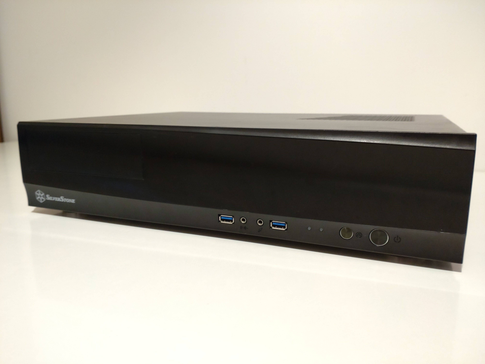
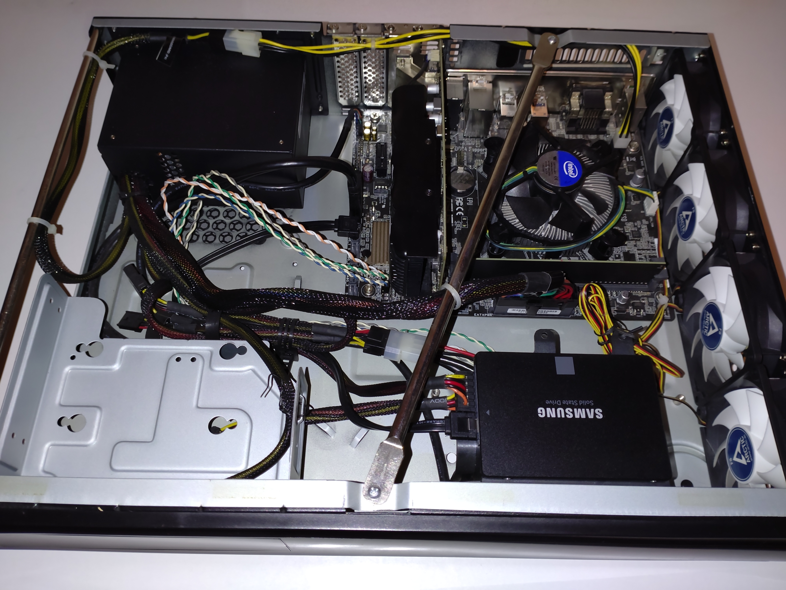
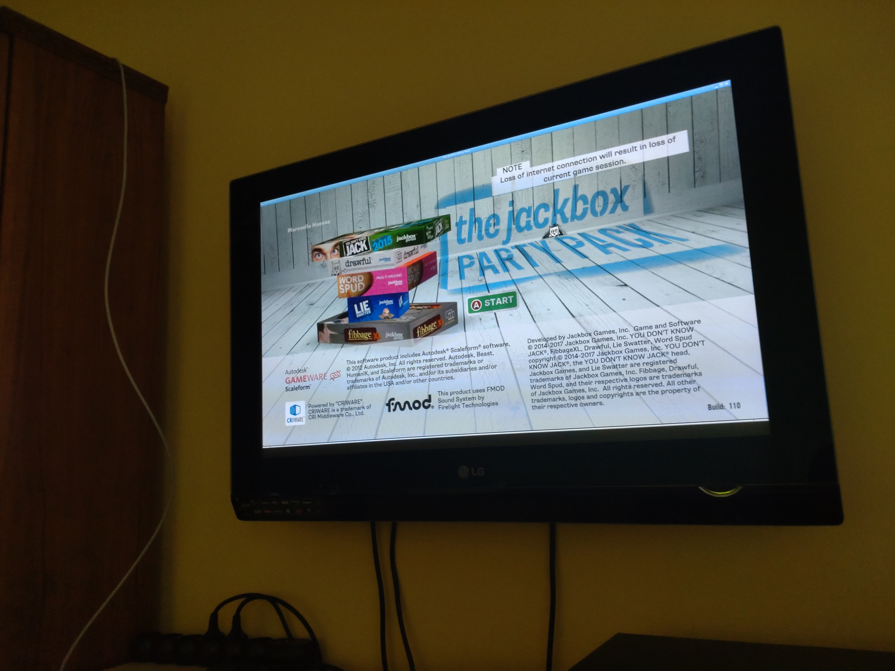

<!-- cspell:ignore HTPC -->
Those who know me, aren't surprised when I simply ignore that there are better solutions to a problem, and start engineering my own solution to it. Sadly, this isn't the case here.

# My precious Steam Box

So, the story started back in 2017ish, when [Steam Deck](https://en.wikipedia.org/wiki/Steam_Deck) wasn't a thing yet, but Valve already invested a lot in Linux Gaming, and their [original SteamOS](https://store.steampowered.com/steamos/buildyourown) wasn't abandoned yet.
My tinkerer self loved the idea of building your own gaming console to play games that I already owned. In fact, I even turned my old Pentium 4 PC to a "Steam Box" for a while, when Steam Big picture was a new thing, but that was short-lived.

Once I've got to university, and got some scholarship money I started saving up to build a machine to this specific reason. I got half the parts used, some were gifted, and I got the rest as new. After about a year I've got everything I needed.



It was nothing spectacular, a 6th gen i3 processor, 8gb of ram, a GTX 1050Ti and 500 gigabytes of spinning rust. But it was all mine, and it was ready to embrace Valve's own SteamOS.



# Software troubles

First SteamOS ran mostly fine. I obviously had to hack things on it, and broke it sometimes, but it worked fine. But after some time, I can't remember exactly why, but it had some issues.

After that I moved in to dormitory where I haven't had a television in my room, so my "Steam Box" were just collecting dust for a few years. In 2022 when I graduated I moved in with my girlfriend to an apartment where I had access to a television yet again. So it was time to set up my beloved "Steam Box" once again.

While I was in the dorm, I've heard of a new thing called Gamer OS which were later renamed to [ChimeraOS](https://chimeraos.org/). Since I had issues with SteamOS back then, and it seemed abandoned, given it's still based on Debian 8. I've decided to give it a go.

I've installed ChimeraOS. And it was awesome! Sure it had some flaws, but I assumed they will be fixed with later upgrades. They delivered exactly what I was looking for. An install-and-forget Linux OS for my living room.

The web management was pretty nicely done, and I could even get some retro games running effortlessly. It just worked, and I loved it.

_Until it doesn't._

One day, I've got a notification from Steam, that [Untitled Goose Game](https://store.steampowered.com/app/837470/Untitled_Goose_Game/) is on sale. I wanted this game for a while, and this was the perfect opportunity to get it. It has a local co-op mode and full controller support, so I've thought that it would be perfect to play it on the TV, with my girlfriend. I've fired up my "Steam Box" to download it, just to be greeted by... a Gnome desktop?

Since I had some custom modifications here and there I thought that maybe I broke something, so I gave a good `blkdiscard` to the SSD, and re-installed ChimeraOS cleanly, to be greeted yet again by Gnome...

After some fruitless googling, I've found a [lone Reddit post](https://www.reddit.com/r/linux_gaming/comments/154wo17/cant_switch_back_to_game_mode_in_chimeraos/) that pointed to the ChimeraOS Discord. (I highly against the idea, that people threat Discord as a forum of some kind, and lock out everyone else from finding solution to their problem, but it is what it is). And indeed [I've found what the problem was](https://discord.com/channels/560281725175988233/1133481947272859728/1133481947272859728) (but sadly, the suggested solution did not work for me).
Long story short, ChimeraOS dropped support for Nvidia GPUs, and they only support AMD ones now. It just happened that ChimeraOS updated now, which had a bug, that broke my system. This was only a question of time since they did no longer test for Nvidia. I can't blame them, Nvidia really gives a hard time for the Linux community.

_But I was mad._

The hardware I had, and would be perfectly capable of running games, but some software wick-wacky prevented me from this.
I've looked up if it would be possible to painlessly just switch to AMD, but sadly they did not seem to manufacture low-profile gpus. (And I had problems with AMD as well, as my desktop have an AMD card). So I couldn't even fix my problem with money. So what could I do?

# Time to re-invent the wheel!

_How hard would it be to build my own simplified "SteamOS"?_

Turn's out, pretty easy, if you go for the bare minimum.

So I've come up with the following plan:

1. Install Debian
2. Install Nvidia Drivers
3. Install Steam
4. Come up with something to boot into Gamepad UI (successor of Big Picture Mode)
5. ???
6. Profit!

I also didn't want to invest much time into this project... I just wanted to finally play! But I had some goals: Keep it super-minimal, and install only what I really need for my games to work.

In the following few sections I will try to write things in a tutorial fashion, but I worked on this project before I created this blog, so I'm doing my best to remember stuff, expect some mistakes.

## Install Debian

That was simple. I got my trusty `blkdiscard`, and cleared the SSD. Then I installed Debian as anyone would do: Through the installer (I know at least seven ways to install Debian, that's why I pointed this out).

I've installed the latest stable version as of today: Debian Bookworm. I figured stable just fits perfectly for this setup.
During install, in [tasksel](https://wiki.debian.org/tasksel) I've chosen only to install the SSH server and nothing else. I want to install just what I need manually.

Also, not that it matters, but I've chosen to install everything on one big partition. This wouldn't be the best choice for some scenarios... but for a living room PC, this is fine.

After the installation was complete, I've logged in using SSH, so I can work from the comfort of my desktop PC.

And started installing stuff! First we will need X, "drivers" for it and some utils to help us to work with it:

```bash
sudo apt install xserver-xorg dbus libpam-systemd x11-common xserver-xorg-legacy x11-xserver-utils x11-xkb-utils dbus-x11 xserver-xorg-input-all xinit xterm
```

I know, Wayland this and Wayland that. The sad truth is that (probably just my bad experience) if you want (somewhat) working proprietary Nvidia drivers in 2023 on your Linux desktop, you've gotta use Xorg. X is still very usable, and for this purpose, it will be sufficient.

Along the utils I've mentioned, I've installed xinit and xterm, those are a great help when you are tinkering with X manually, which I needed while I figured everything out.

Next it was time for PulseAudio! We will need sound after all.

```bash
sudo apt install pulseaudio pavucontrol
```

I know, I know, Pipewire...

I've also installed `pavucontrol`, for debugging purposes later.

**Important:** by default, the Debian installer did not assign the primary user to the `input` group. This generally not a problem, but I've spent at least two hours (which was half of the time I spent on this project as a whole) figuring out that this was the issue why Steam couldn't use my controller. So to make controllers work, add the primary user to the `input` group:

```bash
sudo usermod -a -G input <username>
```

## Install Nvidia Drivers

This was quite simple. Debian packs Nvidia drivers and in my experience this is the most reliable way of having them properly installed and updated.

So, just enable non-free and contrib repos:

```bash
sudo apt edit-sources
```


And install the drivers (along with some stuff we will need in the future)

```bash
sudo apt update
sudo apt install nvidia-driver mesa-vulkan-drivers mesa-utils
```

Keep in mind, that we want to install Steam here... that is still built for 32 bit in 2023. So we also have to install the 32 bit libs as well:

```bash
sudo dpkg --add-architecture i386
sudo apt update
sudo apt install nvidia-driver-libs:i386 libglx-mesa0:i386 mesa-vulkan-drivers:i386 libgl1-mesa-dri:i386
```

After that I rebooted. Started X manually using `xinit` and checked `glxgears` and `glxinfo`. Everything was cool and good.

**Note:** The GTX 1050Ti works fine with the default `nvidia-driver`, but some older Nvidia cards may need legacy drivers, [consult the relevant Debian Wiki page](https://wiki.debian.org/NvidiaGraphicsDrivers) to figure this out for your setup.

## Install Steam

This is also pretty simple, once you figure out some quirks, like I did. Thankfully Steam is available in the Debian 12 repos, once you enable `non-free` software (which I just did).

```bash
sudo apt install steam-installer
```

**Fun fact:** you need to have lsof installed manually, as for some reason the Steam package does not depend on it, but it won't launch without it:

```bash
sudo apt install lsof
```

**Fun fact 2:** Steam depends on NetworkManager to it's networking related stuff. This isn't an issue on desktop, but the Gamepad UI is designed to also provide an interface for basic OS tasks (network management, mounting/unmounting sdcard, sound stuff). Without NetworkManager it can not tell the state of the network and maybe even (wrongly) assume that you are offline and refuse to go online. So we have to install that as well:

```bash
sudo apt install NetworkManager
```

And to let NetworkManger manage the wired interface, we have to remove all related config to it from `ifupdown`'s config:

```bash
# /etc/network/interfaces
# This file describes the network interfaces available on your system
# and how to activate them. For more information, see interfaces(5).

source /etc/network/interfaces.d/*

# The loopback network interface
auto lo
iface lo inet loopback

# config for enp3s0 removed
```

## Come up with something to boot into Gamepad UI

So this is the actual fun part of the project. I knew what I needed, and was sure about what I want to avoid.

First of all, I didn't wanted desktop mode (neither any support for using a mouse-keyboard). I just don't need it. I can understand why is it an integral part of "gaming" operating systems, such as SteamOS and ChimeraOS. But I find it a lot easier to fiddle with the system through the commandline, which I can do just fine over SSH or (if things go wrong) by switching VT.

Secondly, I knew that I also needed some sort of window manager. From my previous experiments I knew that games (or even Steam) are having a hard time going full screen when running on raw X, they need a window manager to do this sort of thing. I looked into [gamescope](https://github.com/ValveSoftware/gamescope), which is what SteamOS and ChimeraOS uses... I know it's not exactly like a window manager (but instead a compositor, because it's for Wayland and Wayland does things differently)... but after a few minutes of reading, I decided, this is not what I needed... even through [it would have been available from the Debian repos](https://packages.debian.org/bookworm/gamescope). So instead, I went with plain and simple [Openbox](https://wiki.debian.org/Openbox). All well behaving games should full-screen themselves along with Steam anyway, so it seems like a perfect choice.

So, considering the above, I've come up with this neat little script:

```bash
#!/bin/bash
# /opt/startup.sh

# set wallpaper
feh --bg-fill /opt/bg.png

# start pulseaudio as a daemon
pulseaudio -D

# start openbox in the background (no startup apps)
openbox &
OPENBOX_PID=$!

# start Steam in "gamepad ui"
steam -steamdeck -gamepadui -steamos3 -steampal

# when Steam exits, kill Openbox and Pulseaudio
kill -TREM $OPENBOX_PID
pulseaudio --kill
```

These are only the bare bones needed to get started. Later I have ~~stolen~~ added many envvars, based on [ChimeraOS's source code](https://github.com/ChimeraOS/gamescope-session/blob/cdf6d4c18497fa00e7ee4c6342b16229a1eaa742/usr/share/gamescope-session/gamescope-session-script) to tailor Steam further for this purpose. Notice that I have also installed [feh](https://packages.debian.org/bookworm/feh) to set an X wallpaper so that I can have some graphics on the screen while Steam is starting up.

After I was satisfied with my script, I needed something that launches it in an X session after startup. For this purpose [nodm](https://github.com/spanezz/nodm) seemed the simplest option of all. I've toyed with it before, and I thought it would be the perfect fit. This is how I configured it:

```bash
# /etc/default/nodm

# nodm configuration

# Set NODM_ENABLED to something different than 'false' to enable nodm
NODM_ENABLED=true

# User to autologin for
NODM_USER=<username>

# First vt to try when looking for free VTs
NODM_FIRST_VT=7

# X session
NODM_XSESSION=/opt/startup.sh

# Options for nodm itself
NODM_OPTIONS=

# Options for the X server.
#
# Format: [/usr/bin/<Xserver>] [:<disp>] <Xserver-options>
#
# The Xserver executable and the display name can be omitted, but should
# be placed in front, if nodm's defaults shall be overridden.
NODM_X_OPTIONS='-nolisten tcp -nocursor'

# If an X session will run for less than this time in seconds, nodm will wait an
# increasing bit of time before restarting the session.
NODM_MIN_SESSION_TIME=60

# Timeout (in seconds) to wait for X to be ready to accept connections. If X is
# not ready before this timeout, it is killed and restarted.
NODM_X_TIMEOUT=30
```

Notice, that I have added `-nocursor` to X options? That's right, by default X positions a cursor at the center of the screen, which wouldn't go away. So I've just disabled the entire X mouse doohickey. This, of course, prevents using any sort of mouse, but I wouldn't need that anyway. (I've tested it, and it seems like this does not affect Steam emulating the mouse for some games.)

# Future improvements

This project was done on the scale of hours, obviously it is nowhere near perfect. Here are some areas that it should be improved per se.

## Work around some games that have trouble going into full screen

So, none of the games I've initially tested had this problem, but I've recently also bought a load of [Jackbox Games](https://www.jackboxgames.com/). For some reason these games don't go into full-screen. So the window border around them, and sometimes Steam in the background are still visible.



I'm currently having a plasma TV, so having static parts on the screen is a bit problematic as it could burn in badly.

So, I need something that changes these games to run in a borderless fullscreen window. I've already seem to [found useful info and some code](https://github.com/FreddyBLtv/borderless-fullscreen) on the matter, so I might update this post later, once I figure this part out.

Although this wouldn't be an issue if I used Gamescope, so I might re-evaluate my possibilities regarading that.

## Replace nodm

nodm is old... The [first commit was made in 2008](https://github.com/spanezz/nodm/commit/eebb441dba9acc9c2876824bac50c27d44c3b19e), which isn't a problem by itself, but sadly, as [its own README states](https://github.com/spanezz/nodm/blob/master/README.md#this-repository-is-not-maintained), it really needs to be refactored to stand up to today's standards, but the project got abandoned, so it won't seem to happen.

There is also one inconvenience (which I was lazy to investigate deeper) but during shutdown nodm restarts the xsession. This causes Steam to restart for a short time then being killed soon after. I don't expect Steam to be prepared for this, so I can only wait until it corrupts something this way.

So sadly, nodm has to go. There are a few possible alternatives, as nodm's author suggests, LightDM autologin is one possibility. I'm also thinking of doing some lower level magic with `xinit`, or directly starting X, but don't know which direction I would end up eventually.

## Add emulators

What was super-cool about ChimeraOS is its built-in emulators. It was super easy to add and play retro games. I'm actually missing this feature.

It would be nice to install some emulators and play retro games on my TV again.

# Conclusion

Although it didn't turn out to be the prettiest solution, I have Steam now, and I can play games, that's literally all I want from this box.

Sure, maintaining it will be a bit more of a chore, than just having a fancy auto-update do everything for me. But I'm hoping for the best. By that, I mean, that a good old `apt update` and `apt upgrade` every few weeks will do it. I've kept custom hacks at a minimum, so there are fewer things to break with an update.

Thank you for reading my very-first blogpost that I post on my very-own blog. This is sort of a debut post, I'm expecting better quality over time. Until then, have a great day!
