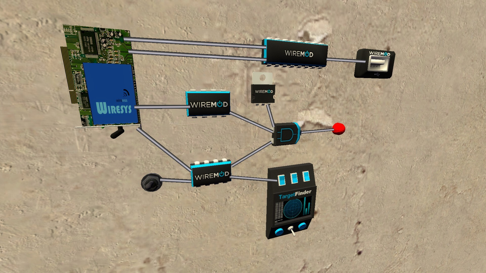
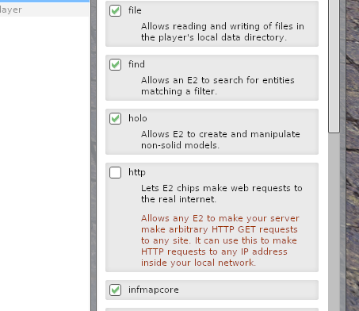
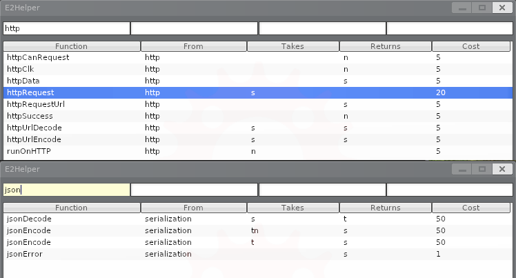
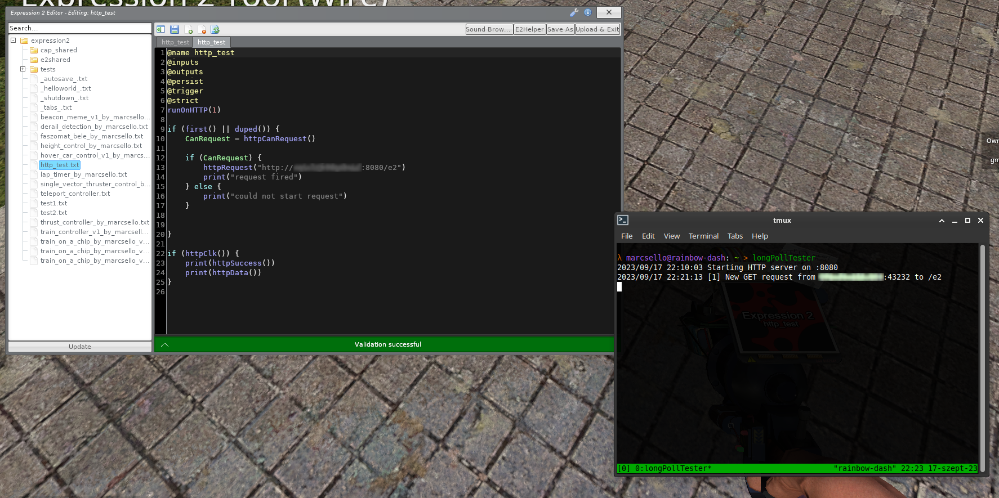
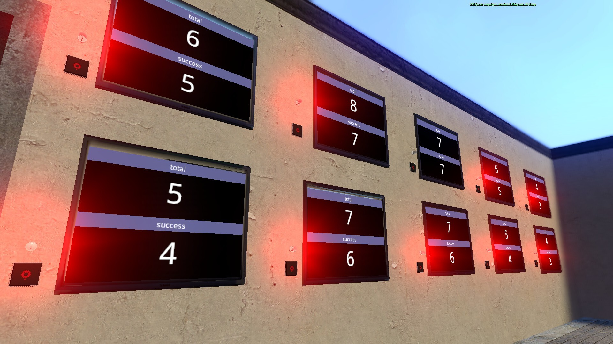
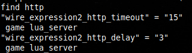
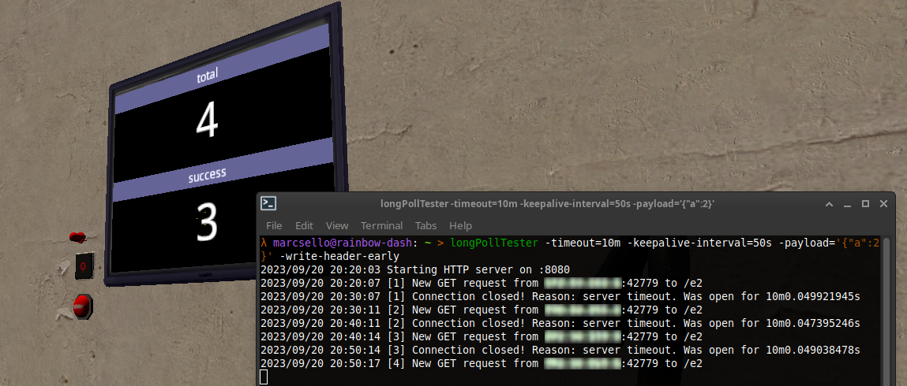
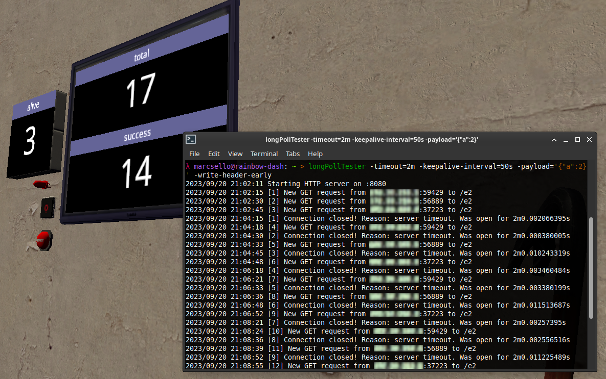
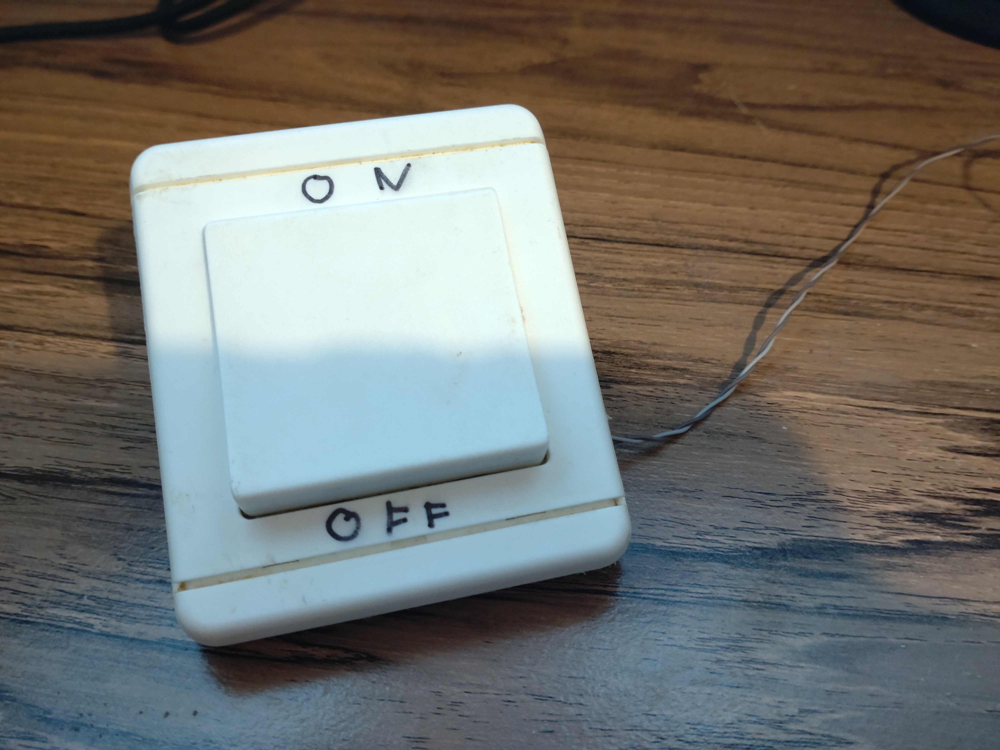

This is one of those posts you can't really appreciate unless you spent part of your childhood building weird contraptions in [Garry's Mod](https://store.steampowered.com/app/4000/Garrys_Mod/) with some cool [Wiremod](https://wiremod.com/) bits.
I was one of those kids.
Sometimes, while I was in the middle of building the most advanced machines I could think of, I found myself running out of keys on my keyboard to control them.
Therefore, I was constantly thinking of ways to add more input to the game.

This thought still bugs me today. Not because I'm still in a huge need of extra buttons, but rather because I'm intrigued by the problem itself.
I'm definitely not playing as much as I used to, but out of nostalgia, I picked up the game again recently, and solving this issue turned out to be the perfect weekend project.

Sure, you can hook up a joystick to your computer, and Garry's mod being a source game, would probably support using it with Wiremod stuff, but that's just about 10% interesting.

# Wiremod and input

For those who does not know Wiremod, really should check it out first, because you wouldn't find this post interesting at all otherwise.
For those who know it well, probably does not need an explanation on what it is, so you can skip to the next chapter. But for those who does not belong in either of these groups, may proceed reading the next few paragraphs.

Wiremod basically adds an imaginary electronics architecture to the game. It allows you to spawn sensors, actuators, a diverse set of input and output things, and various types of control devices.
But as the name suggests, the most powerful part of all these are wires! You can wire all these in any way you want. Unlike in the real world, these wires don't carry electricity, they carry "data"!
All wire devices have inputs and outputs, often multiple, and you can choose how you wire those to your liking.
Wires can carry different types of data, like numbers, strings, or even vectors and many other cool structures.

So basically anything you build will rely on passing data on wires.
Therefore, if you want to add an extra way of "input" to the game, all it has to implement are just wire outputs that represent what you provide on that "input", and you are all set.

One cool thing that Wiremod introduces (among its plethora of other cool stuff) is Expression 2 (E2 for short)! Expression 2 basically lets you create custom chips in the game, with any kind of inputs and outputs and lets you run some custom code on that chip.
It has its own programming language that implements various functions that lets you read and manipulate those inputs, and control those outputs.
But it does not stop just there, it has many other neat features like manipulating the physical world, spawning or breaking props, accessing the chat, etc.

Although it's capabilities to communicate with the outside word is pretty limited.
It does implement one "extension" that restlessly tickles my fancy: **It's ability to make HTTP requests to the outside world.**
See where this is going?

**Note:** _When I started working on this project, I wasn't yet aware of the [new events thing](https://github.com/wiremod/wire/wiki/Expression-2-Events) in Expression 2, so any E2 code presented here may be a bit old-fashioned, but still relevant._

# The HTTP capabilities of Expression 2

Sadly the `http*` functions this "extension" adds to E2, are very limited and poorly documented. So I had to do some code digging, investigation and experimenting.

Basically E2 can only do `GET` requests, and you can only specify the URL for the request.
After the request is made, all you get is a single "boolean" (Wiremod does not actually have a boolean data type, it uses number for that as well; fun fact: all numbers are floating point) to indicate if it was successful, and you can only obtain the response body as a string.
No headers, no other verbs, no HTTP status, no fancy options like timeout, but at least it supports HTTPS.

The other problematic part of the E2 HTTP methods that they are quite expensive (especially if you want to parse JSON). So rapid polling of anything is completely out of the question.

So we are stuck with a slow and costly way of data retrieval... but wait! **Maybe we can implement long-polling!**

Long-polling is basically just starting a long-lived HTTP request and having the server hold up the connection until something happens (or close it after a certain timeout).
By utilizing long-polling, we can get the "events" as soon as they happen (plus network delay) without wasting resources.
It seems like we could make this work somehow.
We just need to make sure that we can open long-lived requests from E2.

# Expression 2 and long-polling

To test the long-polling "capabilities" of E2, I've [quickly hacked together a tool](https://github.com/marcsello/longPollTester) that starts an HTTP server and  measures how long a client can stay connected.
I started this tool on my computer, launched Garry's mod, and entered a single-player game to do some testing.

First, I learned that for some reason E2 refuses to make requests towards `127.0.0.1`, but I've quickly overcame this by using the DNS name of my computer (fun fact: this is an [intentional limitation](https://wiki.facepunch.com/gmod/http.Fetch), but it seems like it's implemented badly).
Second, I have found out, that you really cannot do any fast polling, as there is a delay of about 3 seconds after each request when you are not allowed to do another one.

Regarding the long-polling capabilities, after some measurements it seems that I can reliably run requests even as long as 10 minutes (and possibly above that, but that would take too much time to test).

I have also discovered, that connections does not get closed after you delete the E2 chip.
I could only terminate the connection by quitting from the game.
So the server has to close the connection eventually or the game will keep it open indefinitely, as there is no way to manually interrupt a pending HTTP request!

But the initial success in single-player didn't hold up much in multiplayer.
On my own server with default settings, **I couldn't make a request that lasted longer than 1 minute**.
When I went beyond just a few milliseconds, the request became unsuccessful.
This isn't great... Firing an HTTP request every 63 seconds could be considered spamming by some administrators, which may lead to consequences.

I was also curious how multiple E2 chips would affect each other.
So I spawned a bunch of them, and strangely enough, they did interfere with each other: instead of the 3 second delay, it seemed initially that the individual chips had to wait a lot longer to get a chance to make a request.
But after a few minutes these delays normalized, and all E2 chips were seemingly able to make a request.

After checking the [ConVars](https://developer.valvesoftware.com/wiki/ConVar), and digging up the [Wiremod source code](https://github.com/wiremod/wire), I have found two interesting ConVars `wire_expression2_http_timeout` and `wire_expression2_http_delay`.
The delay one is obviously the 3 sec delay between requests that I've already measured, but the timeout with 15 as it's value is a bit odd.

[Turns out](https://github.com/wiremod/wire/blob/b43c615d86165240917bd5a86a130174538048d2/lua/entities/gmod_wire_expression2/core/http.lua#L19-L21) that value controls a delay, that is after the last request that is still pending.
That explains the weird behavior I've observed above.
Interesting limitation, but I think this is the best they could come up with, as GMod's builtin http client [does not (seem to) support timeouts](https://wiki.facepunch.com/gmod/http.Fetch).
Fortunately these limits seem to be per-player based, so at least I won't upset other players.

# Going beyond one minute

While experimenting with the timeout values, I had an idea: Some HTTP clients timeout if they do not receive any data for a certain amount of time.
In other words, they do not limit the time for the entire request, but only the idle time of the connection (waiting for data to be read).

_What if I dropped a few bits of data every so often on the connection?  Would that prevent E2 from closing the connection?_

I have quickly changed my long-poll tester utility to send the headers as soon as the client connects and send a single byte periodically to keep the connection alive.
And sure enough, I was able to keep up the connection a lot longer.
I went as far as 10 minutes with no issues.

For the "keep-alive" byte, I've chosen whitespace, because I plan to send JSON data trough, and JSON parsers are usually just ignore all whitespace, so I won't need to do any extra fiddling with the response body other than passing it to the parser.

With this trick I was able to solve the short client timeout problem it seems.

# Getting around the 3 second delay

The problem with the 3 second delay after each connection is that, after receiving an event, the request ends.
And the E2 has to wait 3 seconds before making a new one.
This means that the fastest I can send in an event to the game is one every 3 seconds.
And if an event happened to happen while the chip has no open connections and is waiting to initiate a new one, it would not only be delayed until the next connection but would immediately start a 3 second timeout ... again.
This is still okay for most applications, but I was curious if there was any way I could loosen this restriction.
(I could of course set the ConVar to a more favorable timeout, but I want this to work on any multiplayer server)

So, here's an intriguing thought: Can we make the E2 chip to fire off multiple HTTP requests simultaneously?
With some clever server-side coordination, we can respond to only one connection at a time, while the remaining ones can seamlessly receive the subsequent events.
This does not completely solve the reconnection delay problem, but hopefully it makes it a little less painful.

To my amazement, I was able to make it keep up more than one connection without any problem.
I have tested with 3 connections, and they were all successful and restarted after 3 or 15 seconds (depending on when the last request were made).

Now, it might be tempting to go abusive and maintain an excessive number of connections, but that would again be playing with the admins patience, and we don't want to go there.
So I'm planning to keep a healthy amount of 3 connections open only.

**But** just out of curiosity, I ran a test on my own server, to see how many connections can I keep open: It's 3.
After firing the third request successive requests just don't happen.
It seems like they are started from the E2's perspective, but the actual HTTP request doesn't actually get executed by the server.

I couldn't find the reason behind this in the [public source part of GMod](https://github.com/Facepunch/garrysmod).
But by the looks of it, seems like this limitation is coming from the global HTTP client of Garry's mod (which is in the proprietary part).
This is bad news, because that would mean that it affects all HTTP requests made by the server. So I had to dig deeper.

After some tinkering with server-side Lua scripts and other E2 stuff, I uncovered three key insights:

1. This limitation is per-domain. Requests to different domains (or even subdomains) function as expected.
2. The missing requests actually queue up somewhere and execute once other connections are closed. This aligns with my previous tests, where there were 10 chips each making a single connection, yet they eventually managed to establish connections.
3. The restriction is indeed global. When any E2 chip makes 3 connections to the same domain, it blocks others, not even other server-side Lua scripts can make such connections.

Surprisingly, these findings bring some silver linings.
Firstly, we possibly won't interfere with other HTTP requests from the server, having three long-running connections won't fully cripple the server's ability to make HTTP requests (unless they're directed at my server).
The requests won't go missing without a trace.
We **could** even elevate this three connections limit by using multiple (sub) domains.
I'm not going to fiddle with this as I'm happy with my 3 connection limit, but it shouldn't be complicated by using a wild-card domain, and randomly generating part of it each call.

# Making the dream happen

After all this research and experimentation, I felt like I was ready to turn all this into something useful.

The E2 chip I'm planning to create will have a few simple numeric outputs.
The value for each of these outputs will be our "state".
The chip will connect to an HTTP service and wait for state updates.
When it receives such an update, it will set all of it's outputs accordingly.

Based on this idea, and the other ideas I gathered during my research, I designed an HTTP service that does roughly the following:

- When a new connection arrives, the server sends the headers immediately, and sends a space character every 50 seconds to maintain the connection.
- After 10 minutes, the server gracefully closes the connections by sending the last known state. This saves us from having to implement any special response identification and handling on the E2 side.
- State updates are pushed to this service on another endpoint. Upon receiving an update, the server responds to (and thus closes) only the oldest open connection.
- If it fails to deliver the message on that connection (for example the client disconnects) it will reassigns the message to the second-oldest connection, and then to the third-oldest, and so on, until it succeeds.
- The state is passed around in a simple flat JSON object, that's easy to parse with E2.
- Each "state update" has an identifier assigned to it in a strictly ascending manner. Clients can include the id of the last event they are aware of in the url when opening a connection. Using this, the server can tell if the client is not up to date with the latest state and send the update immediately. (This is useful for not missing events that happened while waiting to reconnect)

I have implemented all these in a [small Go program](https://github.com/marcsello/e2-extra-input-server).
I may have cut some corners (like hard-coding the data structure), but I'd say it's okay for an [MVP](https://en.wikipedia.org/wiki/Minimum_viable_product).

I also created [the code for the Expression 2 chip](https://gist.github.com/marcsello/1f708a9cfd3c38ae4edd29991e225f18) in GMod.
It opens three connections at most.
When it receives a response, it parses it and sets the outputs accordingly.
There is not much else going on, it records some statistics and uses timers to do its thing.

# Connecting the two words

All that remains is to put something at the other end of all this. And what could be more fitting than a big junk light switch?

I hooked up the light switch to my Raspberry Pi's [GPIO](https://en.wikipedia.org/wiki/General-purpose_input/output) pins (overkill I know, but the simplest solution for now), and created a tiny Python script to call the other endpoint of the service when the switch is flipped.
By setting the state to 1 when the switch is closed and 0 when it is open, we can use this as a simple boolean value in Wiremod.

<big>**Et voilà! I have a real world light switch, to switch imaginary lamps:**</big>

# Conclusion

Honestly, I love how it all came together. This really is one of my Garry's mod playing child-hood dreams come true.
It's obviously far from perfection.
That junky light-switch was just for the comic effect.
I think an Android app, that I could open on my phone, or tablet while playing would be more appropriate.
But I've been toying with the idea of building some sort of button cluster, and using some sort of microcontroller in place of the Raspberry Pi.

I've since joined one of my current favorite Garry's mod servers to play around with my funky new [human interface device](https://en.wikipedia.org/wiki/Human_interface_device).  
And I can report that it works pretty well on actual multiplayer servers (albeit with more lag).
I've built some cool contraptions using it, and figured out some quirks I hadn't thought of before.

The first is that "reconnect" times (when the E2 chip makes a new connection in place of a closed one) won't always be 3 seconds.
When updates come in quick succession, we not only have to wait for the 3 second delay, but also the 15 second "timeout" as well caused by the previous new connection.
So reconnect times can be anywhere from 3 to 15 seconds, depending on the rate of updates.
I've tried my best to illustrate this in the following diagram:

Another thing I didn't expect to have to pay attention to is that if I remove the E2 chip, and place it again later, there might stale connections still opened by the server to the service.
So when I deploy the chip again somewhere else, it seemingly does not receive the status updates.
That's because of two things:

- The Garry's mod server won't make the new connections for the same domain as there are already three connections open, instead these connections go into the magic queue.
- The service will always direct status updates to the oldest connection, which in this case are the stale connections that are left open.

Thankfully flipping the switch a few times after deploying the new E2 chip solves all these issues, so it's not a big deal once I figure out what's going on.

Well, this concludes our journey here, I hope you found something useful or at least entertaining in this post.
I definitely enjoyed finding my way around these absurd restrictions just to bring this heartfelt creation to life.
But I have to figure out a way to keep my "weekend projects" from taking up almost two weeks.
